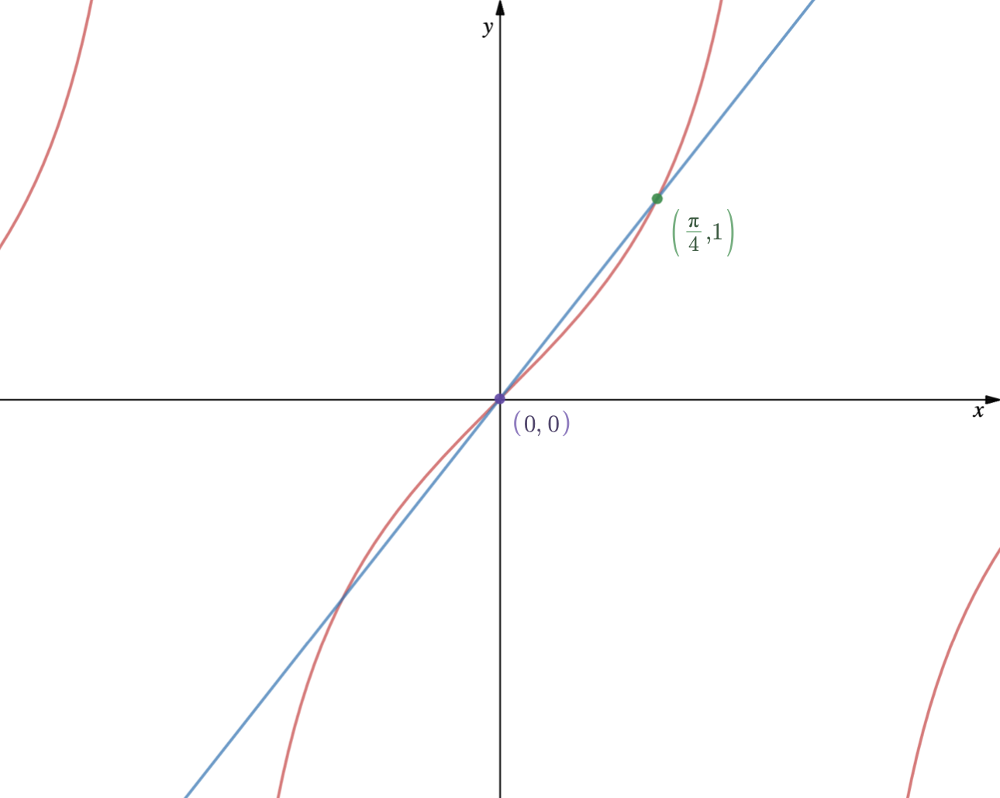

## 비교판정법

### 기본연습문제

> #### Exercise 3.0.3
> 
> 다음 급수의 수렴 여부를 판정하라.
>
> (1) $\sum \frac{1}{n^3}$

> $n \ge 1$이므로 양변을 $n^3$으로 나누어주면 $\frac{1}{n^2} \ge \frac{1}{n^3}$이다. 따라서,
>
> $$\sum \frac{1}{n^3} \le \sum \frac{1}{n^2} \lt \infty$$
>
> 이다.

> (2) $\sum \frac{1}{2n^3+1}$

> $2n^3 + 1 \gt n^2$이므로 $\frac{1}{2n^3 + 1} \lt \frac{1}{n^3}$이다. 따라서,
>
> $$\sum \frac{1}{2n^3 + 1} \lt \sum \frac{1}{n^3} \lt \infty$$
>
> 이다.

> (3) $\sum \frac{1}{2^n + 3^n}$

> $2^n + 3^n \gt 2^n$이므로 $\frac{1}{2^n} \gt \frac{1}{2^n + 3^n}$이다. 그런데 $\sum \frac{1}{2^n}$는 발산하므로 주어진 급수 $\sum \frac{1}{2^n + 3^n}$도 발산한다.

> #### Exercise 3.0.6
>
> 다음 급수의 수렴 여부를 조사하라.
> 
> (1) $\sum \sin \frac{1}{n^2}$

> 함수 $f$를 $f(x) = x - \sin x$라 하자. $f(0) = 0$이고 $f'(x) = 1 - \cos x \ge 0$이므로 구간 $[0, \infty)$에서 $f(x) \ge 0$이다. 달리 말해 $x \ge \sin x$라는 소리이다. 따라서,
>
> $$\frac{1}{n^2} \ge \sin \frac{1}{n^2}$$
>
> 을 얻을 수 있다. 그러므로
>
> $$\sum \sin \frac{1}{n^2} \le \sum \frac{1}{n^2} \le \infty$$
>
> 이다.

> (2) $\sum \tan \frac{1}{n}$
>
> 함수 $f$를 $f(x) = \tan x - x$라 하자. $f(0) = 0$이고 구간 $\left[0, \frac{\pi}{2}\right)$에서 $f'(x) = \sec^2 x - 1 \ge 0$이므로 구간 $\left[0, \frac{\pi}{2}\right)$에서 $f(x) \ge 0$이다. 달리 말하자면 구간 $\left[0, \frac{\pi}{2}\right)$에서 $\tan x \ge x$이다. 따라서,
>
> $$\tan \frac{1}{n} \ge \frac{1}{n}$$
>
> 을 얻을 수 있다. 그런데 조화급수는 발산하므로 주어진 급수 $\sum \tan \frac{1}{n}$도 발산한다.

> (3) $\sum \tan \frac{1}{n^2}$
>
> {:height="40%" width="40%"}
>
> 위의 그림은 $y = \tan x$와 $y = \frac{4}{\pi} x$의 그래프를 비교한 것이다. 구간 $\left[0, \frac{\pi}{4}\right]$에서 
>
> $$\tan x \le \frac{4}{\pi} x$$
>
> 를 알 수 있고, 따라서
>
> $$\tan \frac{1}{n^2} \le \frac{4}{\pi} \times \frac{1}{n^2}$$
>
> 을 얻는다. 그러므로
>
> $$\sum \left( \frac{4}{\pi} \times \frac{1}{n^2} \right) = \frac{4}{\pi} \sum \frac{1}{n^2} \le \sum \tan \frac{1}{n^2} \lt \infty$$
>
> 이다.

> (4) $\sum \sin \sin \frac{1}{n}$

> 구간 $\left[0, \frac{\pi}{2} \right]$에서 
>
> $$\sin x \gt \frac{2}{\pi} x$$
>
> 임을 아는데, $x$ 대신에 $0 \le \sin t \le \frac{\pi}{2}$인 $\sin t$를 넣어도 무방하므로
>
> $$\sin \sin t \gt \frac{2}{\pi} \sin t$$
>
> 이고
>
> $$\sin \sin \frac{1}{n} \gt \frac{2}{\pi} \sin \frac{1}{n}$$
>
> 이다. 그런데, $\sum \sin \frac{1}{n}$은 발산하므로 주어진 급수 $\sum \sin \sin \frac{1}{n}$도 발산한다.

### 연습문제

> #### 1. 임의의 양수 $a$에 대하여 조화급수
>
> $$\sum_{n = 1}^{\infty} \frac{1}{n + a}$$
>
> #### 는 발산함을 보여라.
>
> 자연수 $b$를 $b = [a] + 1$로 잡자. 그러면
>
> $$n + b \gt n + a \Rightarrow \frac{1}{n+a} \gt \frac{1}{n+b}$$
>
> 인데, 
>
> $$\sum_{n = 1}^{\infty} \frac{1}{n+b} = \sum_{n = b + 1}^{\infty} \frac{1}{n}$$
>
> 이다. 그런데, 조화급수는 발산하므로(유한 개의 항의 삭제되었다고 하더라도 급수의 수렴 여부에는 영향을 끼치지 않는다.) 따라서 주어진 급수 $\sum_{n = 1}^{\infty} \frac{1}{n + a}$는 발산한다.

> #### 2. 모든 조화급수는 발산함을 보여라. 즉, 주어진 실수 $a$, $d$에 대하여, $a$가 $-d$의 자연수배가 아니면, 급수
>
> $$\sum_{n = 1}^{\infty} \frac{1}{a + nd}$$
>
> #### 는 발산함을 보이라.
>
> 우선 $d$에 따라 케이스를 나누어보자.
>
> i) $d > 0$
>
> i-1) $a > 0$
>
> $$\sum_{n = 1}^{\infty} \frac{1}{a + nd} = \frac{1}{d} \sum_{n = 1}^{\infty} \frac{1}{n + \frac{a}{d}}$$
>
> 이다. 그런데 연습문제 1에서 보인 바에 따르면 $\sum_{n = 1}^{\infty} \frac{1}{n + \frac{a}{d}}$는 발산하므로 주어진 급수 $\sum_{n = 1}^{\infty} \frac{1}{a + nd}$도 발산한다.
>
> i-2) $a = 0$
>
> $$\sum_{n = 1}^{\infty} \frac{1}{nd} = \frac{1}{d} \sum_{n = 1}^{\infty} \frac{1}{n}$$
>
> 이다. 그런데 조화급수는 발산하므로 주어진 급수 $\sum_{n = 1}^{\infty} \frac{1}{a + nd}$도 발산한다.
>
> i-3) $a < 0$
>
> $$\sum_{n = 1}^{\infty} \frac{1}{a + nd} = \frac{1}{d} \sum_{n = 1}^{\infty} \frac{1}{n - b} \gt \frac{1}{d} \sum_{n = 1}^{\infty} \frac{1}{n} \quad \left(b = -\frac{a}{d} > 0 \right)$$
>
> 이다. 그런데 조화급수는 발산하므로 주어진 급수 $\sum_{n = 1}^{\infty} \frac{1}{a + nd}$도 발산한다.
>
> ii) $d = 0$
>
> 주어진 급수 $\sum_{n = 1}^{\infty} \frac{1}{a}$는 $\lim_{n \to \infty} \frac{1}{a} \ne 0$이므로 일반항 판정법에 의해 발산한다.
>
> iii) $d < 0$
>
> $d > 0$이었던 경우와 마찬가지로 증명하면 된다.
>
> $\therefore$ $\sum_{n = 1}^{\infty} \frac{1}{a + nd}$는 발산한다.

> #### 3. 다음 급수의 수렴 여부를 판정하라.
>
> #### (1) $\sum \frac{1}{\log (n + 1)}$
>
> 우리는
>
> $$\log (n + 1) \lt n + 1 \Rightarrow \frac{1}{n + 1} \lt \frac{1}{\log (n + 1)}$$
>
> 임을 안다. 그런데 조화급수는 발산하므로 주어진 급수 $\sum \frac{1}{\log (n + 1)}$도 발산한다.
>
> #### (2) $\sum \sin^2 \frac{\pi}{n}$
>
> Exercise 3.0.6에서 봤듯이 구간 $[0, \infty)$에서
>
> $$x \ge \sin x$$
>
> 이다. 그러므로
>
> $$x^2 \ge \sin^2 x$$
>
> 이고
>
> $$\left(\frac{\pi}{n}\right)^2 \ge \sin^2 \frac{\pi}{n}$$
>
> 이다. 따라서,
>
> $$\sum \sin^2 \frac{\pi}{n} \le \sum \left(\frac{\pi}{n}\right)^2 \le \infty$$
>
> 이다.
>
> #### (3) $\sum \frac{3n^2 + 4n + 5}{n^3 + 1}$
>
> $$\frac{3n^2 + 4n + 5}{n^3 + 1} \ge \frac{3n^2}{2n^3} = \frac{3}{2n}$$
>
> 이다. 그런데, 조화급수는 발산하므로 주어진 급수 $\sum \frac{3n^2 + 4n + 5}{n^3 + 1}$는 발산한다.
>
> #### (4) $\sum 2^{-n^2}$
>
> $$n^2 \ge n \Rightarrow -n^2 \le -n$$
>
> 이다. 따라서
>
> $$2^{-n^2} \le 2^{-n}$$ 
>
> 이다. 그러므로
>
> $$\sum 2^{-n^2} \le \sum 2^{-n} \le \infty$$
>
> 이다. ($\sum 2^{-n} = \sum \left(\frac{1}{2}\right)^n$인데, 이는 공비가 $\frac{1}{2}$인 등비급수이므로 당연히 수렴한다.)
>
> #### (5) $\sum_{n \ge 2} \frac{1}{(\log n)^{100}}$
>
> 함수 $f_n$을 $f_n (x) = x - (\log x)^n$이라 하자. 그러면 우선 $f_1(x) = x - \log x$이다. ${f_1}'(x) = 1 - \frac{1}{x}$이므로, $x \ge 1$인 구간에서 ${f_1}'(x) \ge 0$이고, 따라서 충분히 큰 수 $x$에선 
>
> $$x - \log x \ge 0 \Rightarrow x \ge \log x$$
>
> 이다.
>
> $f_2 (x) = x - (\log x)^2$이다. 그러므로 ${f_2}' (x) = 1 - \frac{2\log x}{x}$이다. ${f_2}' (x) \ge 0$인 구간은
>
> $$1 - \frac{2\log x}{x} \ge 0 \Rightarrow x \ge 2\log x$$
>
> 인데, 이는 ${f_1}' (x)$의 대소관계에서 보였으므로 (함수의 상수배는 충분히 큰 실수 $x$에서는 크게 영향을 미치지 않기 때문에) 충분히 큰 수 $x$에선
>
> $$x - (\log x)^2 \ge 0 \Rightarrow x \ge (\log x)^2$$
>
> 이다. 이러한 방식을 반복하다 보면 충분히 큰 수 $x$에 대해서는
>
> $$x \ge (\log x)^{100}$$
>
> 임을 알 수 있다. 그러므로
>
> $$\frac{1}{(\log x)^{100}} \ge \frac{1}{x}$$
>
> 이다. 그런데 조화급수는 발산하므로 따라서 주어진 급수 $\sum_{n \ge 2} \frac{1}{(\log n)^{100}}$도 발산한다.

> #### 4. 양의 수열 $(a_n)$과 $(b_n)$에 대하여
>
> $$\lim_{n \to \infty} \frac{a_n}{b_n} = 1$$
>
> #### 이라고 하자. 이때 $\sum a_n$이 수렴할 필요충분조건은 $\sum b_n$이 수렴하는 것임을 보이라. 만약 주어진 식의 오른쪽항이 $1$이 아니고 $2$인 경우는 어떠한가?
>
> $\lim_{n \to \infty} \frac{a_n}{b_n} = 1$이므로 충분히 큰 자연수 $n$에 대해서 $\frac{1}{2} \lt \frac{a_n}{b_n} \lt 2 \Rightarrow \frac{1}{2} b_n \lt a_n \lt 2b_n$이다. 그런데 만약 $\sum b_n$이 발산한다면
>
> $$\frac{1}{2} b_n \lt a_n$$
>
> 이므로 비교판정법에 의해 $\sum a_n$도 발산하게 된다. 그러므로 $\sum b_n$이 수렴해야
>
> $$a_n \lt 2b_n$$
>
> 이므로 비교판정법에 의해 $\sum a_n$도 수렴한다.
>
> 마찬가지의 방법으로 $\sum a_n$이 수렴해야 $\sum b_n$도 수렴함을 알 수 있다.
>
> 한편 주어진 식의 우변이 $2$인 경우에도 비슷한 방식으로 증명하면 $1$인 경우와 마찬가지임을 알 수 있다.

> #### 5. $1$보다 작은 양수 $a$에 대하여
>
> $$\sum a^{\sqrt{n}} \lt \infty$$
>
> #### 임을 다음과 같은 방법으로 보이라.
>
> #### (1) $n \gg 1 \Rightarrow a^{2^{\frac{n}{2}}} \lt 3^{-n}$
>
> #### (2) $\sum 2^n a^{2^{\frac{n}{2}}} \lt \infty$
>
> #### (3) $\sum_{n \ge 1} a^{\sqrt{n}} \le \sum_{n \ge 0} 2^n a^{2^{\frac{n}{2}}} \lt \infty$
>
> (1) 
>
> $$a^{2^{\frac{n}{2}}} \lt 3^{-n} \Rightarrow 2^{\frac{n}{2}} \log a \lt -n \log 3 \Rightarrow 2^{\frac{n}{2}} \gt -n \left(\frac{\log 3}{\log a}\right)$$
>
> 이므로 $n \gg 1$인 자연수 $n$이 임의의 양수 $c$에 대해 
>
> $$2^{\frac{n}{2}} \gt cn$$
>
> 임을 보이면 된다.
>
> $$\lim_{n \to \infty} \frac{2^{\frac{n}{2}}}{cn} = \frac{1}{2c}\lim_{n \to \infty} \frac{2^{\frac{n}{2}}}{\frac{n}{2}} = \infty$$
>
> 이므로 충분히 큰 자연수 $n$에서 $2^{\frac{n}{2}} \gt cn$이다.
>
> (2)
>
> (1)에 의해 $n \gg 1 \Rightarrow a^{2^{\frac{n}{2}}} \lt 3^{-n}$이므로
>
> $$\sum 2^n a^{2^{\frac{n}{2}}} \lt \sum 2^n 3^{-n} = \sum \left(\frac{2}{3}\right)^n$$
>
> 이다. 급수 $\sum \left(\frac{2}{3}\right)^n$는 수렴하므로 비교판정법에 의해 $\sum 2^n a^{2^{\frac{n}{2}}}$도 수렴한다.
>
> (3)
>
> \begin{align\*} \sum_{n \ge 1} a^{\sqrt{n}} &= a^1 + a^\sqrt{2} + a^\sqrt{3} + a^\sqrt{4} + a^\sqrt{5} + \cdots \\\\ &\le a^1 + a^\sqrt{2} + a^\sqrt{2} + a^\sqrt{4} + a^\sqrt{4} + \cdots \\\\ &= \sum_{n \ge 0} 2^n a^{\frac{n}{2}} \end{align\*}
>
> 이다. 급수 $\sum_{n \ge 0} 2^n a^{2^{\frac{n}{2}}}$는 수렴하므로 비교판정법에 의해 주어진 급수 $\sum a^{\sqrt{n}}$도 수렴한다.

> #### 6. 비교판정법이란 무엇인가?
>
> $0 \le a_n \le b_n$일 때,
>
> (i) $\sum b_n \lt \infty \Rightarrow \sum a_n \lt \infty$
>
> (ii) $\sum a_n = \infty \Rightarrow \sum b_n = \infty$
 