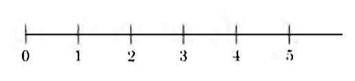

## The Integers

  우리는 물건의 개수를 셀 때 $1, 2, 3, 4, \cdots$와 같은 수를 이용한다. 이러한 숫자를 양의 정수라고 하는데, 자연수라고도 한다. 또, 물건이 아예 없다면 $0$이라는 특수한 숫자를 사용하기도 한다.

### 개념 요약

- 자연수
    + $0, 1, 2, \cdots$와 같이 수를 셀 때 사용하는 수이다. 특히, $1, 2, 3, \cdots$와 같이 $0$을 제외한 자연수를 양의 정수라고 한다.
    + 자연수는 다음과 같이 기하학적으로 표현할 수도 있다. 이렇게 수직선 상에 표현할 때는 $0$을 가리키는 지점을 원점이라고 한다.
    {:height="30%" width="30%"}
- 정수
    + 음의 정수란 양의 정수를 수직선 상에서 원점 대칭시킨 수이다. 
    + 양의 정수, $0$, 양의 정수를 수직선 상에서 원점 대칭시켜 만든 음의 정수를 모두 합하여 정수라고 한다.
- 덧셈의 역원

### 예제

### 연습 문제