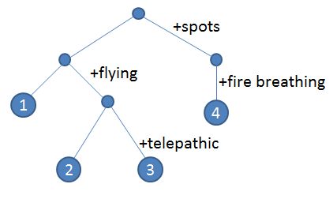

<details markdown="1">
<summary>Problem A. Bucket Brigade</summary>

> #### Problem A. Bucket Brigade
>
>  A fire has broken out on the farm, and the cows are rushing to try and put it out!  
>  The farm is described by a $$10 \times 10$$ grid of characters like this:
>
> > ~~~
> > ..........  
> > ..........  
> > ..........  
> > ..B.......  
> > ..........  
> > .....R....  
> > ..........  
> > ..........  
> > .....L....  
> > ..........  
> > ~~~
>
>  The character 'B' represents the barn, which has just caught on fire. The 'L' character represents a lake, and 'R' represents the location of a large rock.  
>  The cows want to form a "bucket brigade" by placing themselves along a path between the lake and the barn so that they can pass buckets of water along the path to help extinguish the fire. A bucket can move between cows if they are immediately adjacent in the north, south, east, or west directions. The same is true for a cow next to the lake --- the cow can only extract a bucket of water from the lake if she is immediately adjacent to the lake. Similarly, a cow can only throw a bucket of water on the barn if she is immediately adjacent to the barn.  
>  Please help determine the minimum number of '.' squares that should be occupied by cows to form a successful bucket brigade.  
>  A cow cannot be placed on the square containing the large rock, and the barn and lake are guaranteed not to be immediately adjacent to each-other.
>
> > #### Input
> >
> >  The input contains 10 rows each with 10 characters, describing the layout of the farm.
> 
> > #### Output
> >
> >  Output a single integer giving the minimum number of cows needed to form a viable bucket brigade.
> 
> > #### Example Input
> >
> > ~~~
> > ..........
> > ..........
> > ..........
> > ..B.......
> > ..........
> > .....R....
> > ..........
> > ..........
> > .....L....
> > ..........
> > ~~~
> 
> > #### Example Output
> > ~~~
> > 7
> > ~~~

> #### Solution A
>
>  이 문제는 맨하튼 거리를 이용해 쉽게 풀 수 있는 문제입니다. 다만 호수와 헛간 사이에 바위가 있다는 점에 유의하여 풀어야 하는데, 저는 이를 '호수와 바위, 헛간이 모두 일직선 상에 위치하면서 호수와 바위까지의 거리와 헛간과 바위까지의 거리의 합이 호수와 헛간까지의 거리와 같다면 호수와 헛간 사이에 바위가 있다'로 변형하여 풀어냈습니다. 왜냐하면, 호수와 헛간 사이에 바위가 있기 위해서는 무조건 셋 다 일직선 상에 있어야 하기 때문이죠. 또한, 호수와 헛간 사이에 바위가 없다면 호수와 바위까지의 거리와 헛간과 바위까지의 거리의 합이 호수와 헛간까지의 거리와 같지 않다는 점도 고려해야 하기 때문입니다. (겹치는 경로가 존재하게 되어 거리가 더 커지면 안 되니까요.)  
>  또한, 이 문제는 BFS를 통해서도 풀 수 있습니다만 이 방법은 자세히 소개하지 않도록 하겠습니다.  
>  아래는 제 코드입니다.
>
> > ```c++
> > #include <iostream>
> > #include <cstdlib>
> > #include <utility>
> > 
> > int main()  {
> >     std::pair<int, int> barn, lake, rock;
> >     int DistBL, DistBR, DistRL;
> > 
> >     for(int i = 1; i <= 10; ++i)    {
> >         for(int j = 1; j <= 10; ++j)    {
> >             char temp;
> >             
> >             std::cin >> temp;
> > 
> >             switch(temp)  {
> >                 case 'B' : barn = std::make_pair(i, j); break;
> >                 case 'L' : lake = std::make_pair(i, j); break;
> >                 case 'R' : rock = std::make_pair(i, j); break;
> >             }
> >         }
> >     }
> > 
> >     DistBL = abs(barn.first - lake.first) + abs(barn.second - lake.second);
> >     DistBR = abs(barn.first - rock.first) + abs(barn.second - rock.second);
> >     DistRL = abs(rock.first - lake.first) + abs(rock.second - lake.second);
> > 
> >     if((barn.first == lake.first || barn.second == lake.second) && DistBL == DistBR + DistRL)    {
> >         std::cout << DistBL + 1 << "\n";
> >     }
> >     else {
> >         std::cout << DistBL - 1 << "\n";
> >     }
> > 
> >     return 0;
> > }
> > ```

</details>

<details markdown="1">
<summary>Problem B. Milk Factory</summary>

> #### Problem B. Milk Factory
>
>  The milk business is booming! Farmer John's milk processing factory consists of $$N$$ processing stations, conveniently numbered $$1 \cdots N$$ ($$1 \le N \le 100$$), and $$N - 1$$ walkways, each connecting some pair of stations. (Walkways are expensive, so Farmer John has elected to use the minimum number of walkways so that one can eventually reach any station starting from any other station).  
>  To try and improve efficiency, Farmer John installs a conveyor belt in each of its walkways. Unfortunately, he realizes too late that each conveyor belt only moves one way, so now travel along each walkway is only possible in a single direction! Now, it is no longer the case that one can travel from any station to any other station.  
>  However, Farmer John thinks that all may not be lost, so long as there is at least one station $$i$$ such that one can eventually travel to station $$i$$ from every other station. Note that traveling to station $$i$$ from another arbitrary station $$j$$ may involve traveling through intermediate stations between $$i$$ and $$j$$. Please help Farmer John figure out if such a station $$i$$ exists.
>
> > #### Input
> >
> >  The first line contains an integer $$N$$, the number of processing stations. Each of the next $$N - 1$$ lines contains two space-separated integers $$a_i$$ and $$b_i$$ with $$1 \le a_i, b_i \le N$$ and $$a_i \ne b_i$$. This indicates that there is a conveyor belt that moves from station $$a_i$$ to station $$b_i$$, allowing travel only in the direction from $$a_i$$ to $$b_i$$.
>
> > #### Output
> >
> >  If there exists a station $$i$$ such that one can walk to station $$i$$ from any other station, then output the minimal such $$i$$. Otherwise, output $$-1$$.
>
> > #### Example Input
> > ~~~
> > 3  
> > 1 2  
> > 3 2
> > ~~~
>
> > #### Example Output
> > ~~~
> > 2
> > ~~~

> #### Solution B
>
> > ```c++
> > #include <iostream>
> > #include <vector>
> > #include <cstring>
> > 
> > int explore(int cur, int i);
> > 
> > std::vector<int> Station[100 + 5]; 
> > int P[100 + 5][100 + 5] = {0, };
> > int visited[100 + 5] = {0, };
> > 
> > int current = 0;
> > 
> > int main()  {
> >     int N, answer = 10000;
> >     bool flag;
> >     
> >     std::cin >> N;
> > 
> >     for(int i = 1; i < N; ++i) {
> >         int a, b;
> > 
> >         std::cin >> a >> b;
> > 
> >         Station[a].push_back(b);
> >     }
> > 
> >     for(int i = 1; i <= N; ++i)    {
> >         memset(visited, 0, sizeof(visited));
> >         current = i;
> >         explore(current, i);
> >     }
> > 
> >     for(int i = 1; i <= N; ++i) {
> >         flag = true;
> >         for(int j = 1; j <= N; ++j) {
> >             if(!P[j][i])    {
> >                 flag = false;
> >                 break;
> >             }
> >         }
> > 
> >         if(flag)  {
> >             answer = (answer < i)? answer: i;
> >         }
> >     }
> > 
> >     if(answer > 100)    {
> >         answer = -1;
> >     }
> > 
> >     std::cout << answer << "\n";
> > 
> >     return 0;
> > }
> > 
> > int explore(int cur, int i)  {
> >     visited[i] = 1;
> > 
> >     P[cur][i] = 1;
> > 
> >     for(int j : Station[i]) {
> >         if(visited[j])  {
> >             continue;
> >         }
> > 
> >         explore(cur, j);
> >     }
> > 
> >     return 0;
> > }
> > ```

</details>

<details markdown="1">
<summary>Problem C. Cow Evolution</summary>

> #### Problem C. Cow Evolution
>
>  It is the year 3019, and a surprising amount of bovine evolution has transpired in the past thousand years, resulting in cows with all sorts of interesting features.  
>  The bovine evolutionary record can be described as a tree, starting with a basic ancestral cow at the root with no special features. At each descendant level in the tree, either all cows evolve a new feature (such as fire breathing, below, where all cows with spots ended up breathing fire), or there is a divergent split in the bovine population where some of the cows evolve a new feature (e.g., flying) and some do not.  
> 
>  The leaves at the bottom of the tree indicate all the resulting sub-populations of cows in the year 3019. No leaves (sub-populations) contain identical sets of features. For example, sub-population #1 contains cows with no special features, while sub-population #3 contains telepathic flying cows. Sub-population #2, by contrast, has flying cows that are not telepathic. Sub-population #3 is unique in its combination of flying and telepathic cows.  
>  An evolutionary tree like the one above is called "proper" if each newly evolved feature originates in exactly one edge of the tree (e.g., it evolved into being at a single point in history). For example, a tree would not be proper if spots evolved into being in two separate branches. Given a description of the sub-populations of cows in the year 3019, please determine if these can be described by a proper evolutionary tree.
>
> > #### Input
> >
> >  The first line of input contains the number of sub-populations, $$N$$ ($$2 \le N \le 25$$). Each of the next $$N$$ lines describes a sub-population. The line starts with an integer $$K$$ ($$0 \le K \le 25$$), then $$K$$ characteristics of all the cows in that sub-population. Characteristics are strings of up to 20 lowercase characters (a..z). No two sub-populations have exactly the same characteristics.
>
> > #### Output
> >
> >  Please output "yes" if it is possible to form a proper evolutionary tree explaining the origin of these sub-populations, and "no" otherwise.
>
> > #### Example Input
> >
> > ```
> > 4
> > 2 spots firebreathing
> > 0
> > 1 flying
> > 2 telepathic flying
> > ```
>
> > #### Example Output
> >
> > ```
> > yes
> > ```
>
> #### Solution
>
> > ```c++
> > 
> > ```