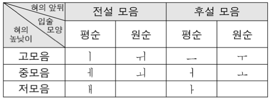

## 2019학년도 대학수학능력시험 국어 영역 문제 및 해설

  아래 문제의 저작권은 한국교육과정평가원에 있습니다. 필자는 비영리 교육 목적으로 해설을 작성하였음을 미리 밝힙니다.

  궁금한 점이나 잘못된 점이 있으시면 댓글로 남겨주세요. 빠르게 응답하겠습니다 :)

#### [1 ~ 3] 다음은 라디오 방송이다. 물음에 답하시오.

>  혹시 어두운 밤길을 걸어 본 적이 있으신가요? 예전에 제가 밤길을 혼자 걸은 적이 있는데요, 처음엔 어둡고 무서웠지만 달빛 덕분에 어렵지 않게 걸었답니다. 여러분의 삶에 든든한 달빛 같은 방송, 청취자의 사연을 읽고 상담해 주는 ‘나에게 말해 줘’ 시간입니다. 저는 이 방송의 진행자인 심리 상담가 ○○○입니다. 오늘의 사연을 읽어 드릴게요.
>
> >  저는 고등학생 □□라고 해요. 제 친구는 자꾸 친구들과 비교하면서 자신이 못났다고 생각해요. 차분하고 손재주도 좋은 친구인데 스스로를 그렇게 생각하는 게 안타까워요. 또 작은 실수에도 "난 항상 이래."라며 자책하고 우울해해요. 그런 생각을 안 하도록 돕고 싶은데 방법을 모르겠어요.
>
>  □□님은 스스로를 못났다고 생각하는 친구를 돕고 싶은데 방법을 모르신다는 거네요. 친구를 생각하는 마음이 참 따뜻하게 느껴져요. 저도 □□님처럼 안타깝네요.
>
>  자신의 능력과 가치에 대한 전반적인 평가와 태도를 나타내는 말을 자존감이라고 합니다. 자존감이 낮은 원인은 다양하지만 일반적으로 알려진 것에는 남과 비교하는 버릇이 원인인 경우와 자책하는 태도가 원인인 경우가 있습니다. 사연 속 친구는 자신을 다른 사람과 비교해서 열등감을 느끼고, 사소한 실수에도 자신을 탓하며 스트레스를 받아서 자존감이 낮아진 것으로 보이네요.
> 
>  이러한 경우에는 ‘장점 말해 주기’와 ‘감정 헤아려 주기’ 방법이 도움이 될 수 있어요. 먼저 친구가 현재 가지고 있는 긍정적인 면들을 자주 말해 주세요. 그러면 친구가 자신의 장점을 깨닫고 남과 비교하지 않을 거예요. 그리고 친구의 마음을 헤아려 주세요. 만약 친구가 실수해서 자책하고 있으면 “많이 속상하겠구나. 괜찮아. 누구나 그럴 수 있어.”라며 친구의 감정을 이해해 주는 식으로요. 그러면 친구가 스스로 괜찮다고 느껴 스트레스를 덜 받고 자책하지 않을 거예요.
>
>  오늘 방송 잘들으셨나요? 저에게 하고 싶은 말이나 청취 소감은 언제든 게시판에 올려 주세요. 그럼 △△의 노래 ‘우리 함께’를 들으며 오늘 방송 마치겠습니다. 추운 날씨에 감기 조심하세요.

> #### Problem 1
>
>  위 방송 진행자의 말하기 방식에 대한 설명으로 가장 적절한 것은?
>
> 1. 사연 내용을 정리하고 사연 신청자의 마음에 공감하고 있다.
> 2. 사연 신청자의 궁금증을 해소하고 다음 방송을 예고하고 있다.
> 3. 사연 내용을 선정하게 된 동기를 밝히고 청취자의 참여를 독려하고 있다.
> 4. 사연과 관련된 자신의 과거 경력을 소개하고 전문성을 부각하고 있다.
> 5. 사연에 대한 상담 중에 질문을 던지고 사연 속 상황을 다양한 관점에서 생각해 보도록 유도하고 있다.

> #### Solution 1
>
> 1. 윗글 3문단의 '□□님은 스스로를 ~ 저도 □□님처럼 안타깝네요.'를 통해 사연 내용을 정리하고 사연 신청자의 마음에 공감하는 모습을 찾을 수 있다. (O)
> 2. 윗글 5문단 전체의 내용으로 보아 사연 신청자의 궁금증을 해소하였다고 볼 수 있다. 그러나 다음 방송을 예고하는 모습은 찾아볼 수 없다. (X)
> 3. 사연 내용을 선정하게 된 동기를 윗글에선 찾아볼 수 없다. 다만, 청취자의 참여를 독려하는 모습은 윗글 마지막 문단의 '저에게 하고 싶은 말이나 청취 소감은 언제든 게시판에 올려 주세요.'에서 찾아볼 수 있다. (X)
> 4. 윗글 첫 문단의 '저는 이 방송의 진행자인 심리 상담가 ○○○입니다.'를 통해 자신의 과거 경력을 소개하고 전문성을 부각하고는 있지만 사연과 관련된 경력이라고 보기는 힘들다. (X)
> 5. 사연에 대한 상담 중에 질문을 던지는 모습은 윗글에서 찾아볼 수 없다. 또, 사연 속 상황을 다양한 관점에서 생각하도록 유도하는 모습도 찾아볼 수 없다. (X)
>
> 답 : [1] 사연 내용을 정리하고 사연 신청자의 마음에 공감하고 있다.

> #### Problem 2
>
>  다음은 위 방송을 진행하기 위해 진행자가 세운 계획이다. 방송에 반영되지 <u>않은</u> 것은?
>
> > [__오프닝__] 방송의 취지를 드러내기 위해 '달빛' 이야기로 시작
> > 
> > [__사연 소개 및 고민 진단__]
> >
> > - 사연 신청자가 보낸 사연 소개
> > - 내용의 이해를 돕기 위해 자존감이라는 용어의 의미 제시 ... ㉠
> > - 자존감이 낮은 원인 중 일반적으로 알려진 원인을 제시하고 사연의 문제 상황에 적용 ... ㉡
> > - 사연의 문제 상황을 설명하기 위해 유사한 문제 상황 제시 ... ㉢
> >
> > [__방법 제시__]
> >
> > - ‘장점 말해 주기’ 방법을 안내하고 효과 제시 ... ㉣
> > - ‘감정 헤아려 주기’ 방법을 예를 들어 소개하고 효과 제시 ... ㉤
> >
> > [__클로징__] 청취자 게시판에 관한 안내 및 인사말로 마무리
>
> [1] ㉠    [2] ㉡      [3] ㉢      [4] ㉣      [5] ㉤

> #### Problem 3
>
> 다음은 위 방송을 들은 청취자들이 게시판에 올린 댓글이다. 방송 내용을 고려하여 청취자들의 반응을 분석한 것으로 적절하지 <u>않은</u> 것은? [3점]
>
> > 
'나에게 말해 줘' 게시판

> >
> > > ○월 ○일 방송에 대해 자유롭게 의견을 남겨주세요.
> >
> > ↳ 청취자 1 : 저도 자존감이 낮은 거 같아서 좋은 방법이 나오기를 기다리며 들었는데, 스스로 자존감을 높이는 방법은 안 나오네요.
> >
> > ↳ 청취자 2 : 자존감을 높여주려면 자기만 부족하다는 생각에서 벗어나게 해 주라는 거네요. 그렇다면 가능한 목표를 세워서 도달하게 하는 방법도 성취감을 느낄 수 있게 해 주어 자존감을 높이는 데 도움이 되겠군요.
> >
> > ↳ 청취자 3 : 딸아이의 자존감이 향상되도록 앞으로는 제 아이에게 긍정적인 면들을 말해 줘야겠어요.
> >
> > ↳ 청취자 4 : 도와주고 싶은 대상의 연령대가 사연 속 친구와 다를 때에도 방속에서 알려 준 방법대로 해도 되는 건가요?
> >
> > ↳ 청취자 5 : 감정을 헤아려 주는 건 좋은 방법이네요. 제가 직설적으로 말하는 버릇이 있어서 친구들이 속상했을 텐데 활용해 볼게요.
>
> 1. ‘청취자 1’은 자신이 방송을 들은 목적과 관련해 방송 내용이 충분하지 않다고 판단하고 있군.
> 2. ‘청취자 2’는 방송 내용을 이해한 바를 확인하고 방송에서 안 내되지 않았던 방법의 효과를 예측하고 있군.
> 3. ‘청취자 3’은 방송에서 언급한 방법을 다른 사람들에게 권유 하고 적용할 것을 다짐하고 있군.
> 4. ‘청취자 4’는 방송에서 제시한 방법을 다른 경우에도 적용할 수 있는지 궁금해하고 있군.
> 5. ‘청취자 5’는 방송에서 언급한 방법을 긍정적으로 평가하고 자신의 언어 습관을 반성하고 있군.

---

#### [4 ~ 7] (가)는 학교 신문에 실을 기사문의 초고이고, (나)는 (가)를 수정하기 위한 회의이다. 물음에 답하시오.

> __(가)__
>
> 
<strong>[표제] 성금 마련을 위해 모두가 함께해</strong>

>
> __[전문]__ 지난 10월 4일 우리 학교 선생님들과 학생들은 K 군을 돕기 위해 응원 메시지를 달고 사제동행 마라톤 행사를 함께했다.
>
> __[본문]__ 선생님 32명과 학생 174명이 함께 달린 이 행사는 K 군(2학년)의 쾌유를 기원하기 위해 학생회가 주최하였다. 한 달 전 교실에서 쓰러져 입원한 K 군의 소식이 알려지자 학생들이 병원비 모금을 위해 자발적으로 나서서 의미가 컸다. 또한 행사 참가자들은 모두 5천 원씩의 성금을 내고 학교 인근 △△공원 일대 4km 구간을 완주했다. 
>
> 이날 행사에 참가한 학생들은 평소 마라톤을 즐겼던 K 군을 생각하며 응원 메시지를 가슴에 달고 뛰었다. △△공원을 찾은 많은 시민들은 이 모습을 보고 학생들과 선생님들에게 힘내라며 응원을 보냈다. 이날 많은 시민들이 △△공원을 찾았다. 마라톤이 끝난 뒤, 행사의 취지에 공감하며 성금을 기탁한 시민도 있었다. K 군의 담임선생님은 “친구를 돕기 위해 학생회가 앞장선 모습이 무척 감동적이었다.”라고 말했다.
>
> __(나)__
>
> __학생 1__ : 사제동행 마라톤 행사를 다룬 기사문을 검토할게.
>
> __학생 2__ : 이 기사문은 네가 작성한 거지?
>
> __학생 3__ : 응, 초고라서 부족한 게 많을 것 같아.
>
> > 
<strong>[A]</strong>

> >
> > __학생 1__ : 우선 표제와 전문에 대해 논의하자. 표제를 수정하고, 전문은 육하원칙 중 빠진 내용을 추가해야 할 것 같아.
> >
> > __학생 3__ : ㉠ <u>네 말을 들으니 전문은 어떤 내용을 추가해야 할지 알겠는데, 표제는 어떤 문제가 있는지 좀 더 말해 줄래?</u>
> >
> > __학생 1__ : 표제는 중심 소재를 담고 있어야 하는데 현재 표제에는 어떤 행사가 열렸는지 드러나지 않잖아.
> >
> > __학생 3__ : 그러게, 표제에 그런 문제가 있었구나.
> >
> > __학생 1__ : 그리고 행사의 의미를 비유적 표현을 활용해서 써보는 건 어때?
> >
> > __학생 2__ : 그러면 한눈에 기사 내용을 알아보기 어렵잖아. 대신에 참가 인원수를 적자.
> >
> > __학생 1__ : ㉡ <u>네 말대로 하면 행사 규모에 초점이 맞춰져서 행사의 의미를 드러내려는 기사문의 의도가 살지 않으니, 그렇게하면 안 될 것 같아.</u>
> >
> > __학생 3__ : 두 의견을 들어 보니, 네 의견대로 중심 소재를 담고 화합이라는 행사의 의미를 드러낼 수 있도록 비유적 표현을 활용해서 표제를 다시 작성하는 게 좋을 것 같아.
> > 
> > __학생 1, 2__ : 응, 그래.
> 
> > 
<strong>[B]</strong>

> >
> > __학생 1__ : 다음으로 본문에 대해 논의하자.
> >
> > __학생 3__ : ㉢ <u>선생님과 학생이 한마음으로 행사에 참여한 모습이 드러나게 쓰려 했는데, 어때?</u>
> >
> > __학생 2__ : 응, 그 점은 잘 드러나게 쓴 것 같아. 그런데 선생님들도 응원 메시지를 직접 써서 가슴에 달고 뛰셨는데 본문에 그 내용을 빠뜨린 것 같아. 수정이 필요해.
> >
> > __학생 3__ : 그 부분은 일부러 그렇게 쓴 건데, 이상해?
> >
> > __학생 2__ : 왜 그렇게 표현했는지 궁금해.
> >
> > __학생 3__ : 응원 메시지에 대한 아이디어를 학생들이 제안한거라 학생의 역할을 강조하면 좋겠다고 생각해서 그랬어.
> >
> > __학생 2__ : 실제 사실에 대한 부분은 정확히 다뤄야지. 개인적인 관점에 따라 정보를 누락하면 안 돼.
> > 
> > __학생 1__ : 맞아. 정보를 객관적으로 전달해야지.
> >
> > __학생 3__ : 그러게. 내가 잘못 생각했네. 수정해 올게.
>
> __학생 1__ : ㉣ <u>그런데 이번 행사는 그 의미가 중요한 만큼 본문의 마지막 부분에 화합을 드러내는 내용을 담기로 하지 않았어?</u>
>
> __학생 3__ : 아, 맞다. 지난 회의에서 그러자고 했는데 잊었네. 거기에 학생 인터뷰를 넣기로 했었는데 그것도 안 넣고.
>
> __학생 1__ : 응, 학생회장이 행사를 주최하면서 어려웠던 점에 대해 말한 인터뷰 있잖아. 그걸 넣으면 될 것 같아.
>
> __학생 2__ : 행사 이후 결과에 대한 내용도 포함되면 좋겠어.
>
> __학생 3__ : ㅗ마워. 지금까지 나온 의견 모두 반영해서 써 볼게.
>
> __학생 1__ : 그런데 글의 분량도 생각해야 할 것 같아.
>
> __학생 2__ : ㉤ <u>기사문이 실릴 지면이 한정되어 있으니까 추가로 작성할 내용은 많지 않아야 하지 않을까?</u>
>
> __학생 1__ : 지금 다시 읽어 보니 본문에 불필요하게 중복된 내용의 문장이 있어. 그걸 삭제하면 글의 분량이 줄어들 것 같아.
>
> __학생 3__ : 지면의 크기도 염두에 두면서 기사를 써야 하는 구나. 알겠어. 그렇게 할게.
>
> __학생 2__ : 아, 그리고 성금을 5천 원씩 낸 건 학생이었고, 선생님은 만 원씩 내셨어. 사실에 맞게 본문을 수정해 줘.
>
> __학생 3__ : 그럴게. 처음 써 본 기사문이라 부족한 게 많아.
>
> __학생 1, 2__ : 괜찮아. 기사 쓰느라 고생했어.

> #### Problem 4
>
>  '학생 3'이 (나)를 참고하여 (가)를 고쳐 쓰기 위해 세운 계획으로 적절하지 <u>않은</u> 것은?
>
> > - 표제 수정하기
> >
> > → '작은 물방울들 하나 되어 희망 만든 사제동행 마라톤'으로 수정해야겠군. ... ㉮
> >
> > - 전문 수정하기
> >
> > → ‘지난 10월 4일 △△공원 일대에서 우리 학교 선생님들과 학생들은 K 군을 돕기 위해 응원 메시지를 달고 사제동행 마라톤 행사를 함께했다.’로 고쳐야겠군. ... ㉯ 
> >
> > - 본문 수정하기
> >
> > → 첫째 문단 마지막 문장을 ‘또한 행사 참가자들 중 선생님은 1만 원씩, 학생은 5천 원씩의 성금을 내고 학교 인근 △△공원 일대 4km 구간을 완주했다.’로 수정해야겠군. ... ㉰
> >
> > → 둘째 문단 첫 문장을 ‘이날 행사에 참가한 학생들은 평소 마라톤을 즐겼던 K 군을 생각하며 응원 메시지를 직접 써서 가슴에 달고 뛰었다.’로 고쳐야겠군. ... ㉱
> >
> > → 둘째 문단에서 ‘이날 많은 시민들이 △△공원을 찾았다.’를 삭제해야겠군. ... ㉲
>
> [1] ㉮ [2] ㉯ [3] ㉰ [4] ㉱ [5] ㉲

> #### Problem 5
>
>  (나)를 바탕으로 할 때, (가)의 마지막 부분에 추가로 작성할 내용으로 가장 적절한 것은?
>
> 1. 학생회장은 “행사 홍보가 힘들었지만 즐거운 경험이었다.”라고 밝혔다. 선생님과 학생 누구도 중도에 포기하지 않고 함께 달린 의미 있는 행사였다.
> 2. 학생회장은 “준비 기간이 짧아서 부족한 점이 있었지만 무사히 마무리되어 기뻤다.”라고 밝혔다. 행사에서 모인 성금은 다음 날 학생회장이 대표로 K 군 가족에게 전달했다.
> 3. 학생회장이 계획하고 준비한 이번 행사는 선생님과 학생들이 한마음으로 참여한 인상적인 행사였다. 행사 이후 K 군 가족은 성금을 전달받고, 학교에 감사의 뜻을 전했다.
> 4. 학생회장은 “장소 섭외가 힘들었지만 뜻 깊은 경험이었다.”라고 밝혔다. 선생님과 학생들이 한마음이 되어 성공적으로 행사를 마쳤고, 모금된 성금은 K 군 가족에게 전달됐다.
> 5. 학생회장은 “어려운 친구를 생각하며 기쁘게 완주했다.”라고 밝혔다. 선생님과 학생들이 함께 달리며 뜻을 모을 수 있었던 행사였으며, 학생회에서 성금을 K 군 가족에게 전달했다.

> #### Problem 6
>
>  대화의 흐름을 고려할 때, ㉠ ~ ㉤에 대한 이해로 적절하지 <u>않은</u> 것은?
>
> 1. ㉠ : 상대의 제안 중에서 추가적인 정보가 필요한 부분에 대한 설명을 상대에게 요청하는 발화이다.
> 2. ㉡ : 상대의 제안은 기사문에서 강조하려는 바와 달라지게 한다고 판단하여 반대 의사를 상대에게 전달하는 발화이다.
> 3. ㉢ : 화합의 모습을 표현하려는 의도가 본문에 나타나는지에 대한 상대의 생각을 확인하는 발화이다.
> 4. ㉣ : 본문의 마지막 부분의 작성에 대해 논의했던 사항이 무엇인지를 상대에게 환기하는 발화이다.
> 5. ㉤ : 글의 분량을 언급한 상대의 의견에 대해 지면의 크기를 이유로 들어 상반된 의견을 드러내는 발화이다.

> #### Problem 7
>
>  [A], [B]의 담화에 대한 설명으로 가장 적절한 것은?
>
> 1. [A]에서 ‘학생 3’은 ‘학생 1’과 ‘학생 2’의 의견이 대립하는 상황에서 양측에 절충안을 제시하고 있다.
> 2. [B]에서 ‘학생 2’는 ‘학생 3’의 의견은 비판하고 있고, ‘학생 1’의 의견은 지지하고 있다.
> 3. [A]에서 ‘학생 3’은 ‘학생 1’의 의견을, [B]에서 ‘학생 3’은 ‘학생 2’의 의견을 수용하고 있다.
> 4. [A]와 [B]에서는 모두 ‘학생 1’이 ‘학생 2’의 의견의 타당성을 인정하고 있다.
> 5. [A]와 [B]에서는 모두 ‘학생 2’가 ‘학생 1’이 제시한 의견을 점검하고 있다.

---

#### [8 ~ 10] 글을 쓰기 위해 (가)의 메모를 작성한 후, (나)의 자료를 수집하고 (다)를 작성하였다. 물음에 답하시오.

> __(가) 학생의 메모__
>
> - __학습 활동 과제__ : 사회적 쟁점에 대해 학급 학생들에게 주장하는 글을 쓴다.
>
> - __학급 학생들에 대한 분석__
>
> > - 일부 학생들은 로봇세가 무엇인지 잘 모른다. ... ㉠
> > - 로봇세를 도입하려는 목적을 궁금해하는 학생들이 있다. ... ㉡
> > - 로봇세를 알고 있는 학생들 중에는 나와 상반되는 견해를 가진 학생들도 있다. ... ㉢
>
> __(나) 학생이 수집한 자료의 일부__
>
> > 한 설문 조사에서 ⓐ <u>전체 응답자 중 86.6%가 로봇이 일자리를 빼앗을 것이라고, 52.2%는 자신의 직업이 로봇으로 인해 위협받게 될 것이라고 응답</u>했다. 과거에도 ⓑ <u>새로운 기계가 도입되면서 일부 분야에서 일자리가 줄어든 경우</u>가 있었지만, 산업 전반적으로는 일자리가 증가했다. ...(중략)... ⓒ <u>로봇 기술 중 상당수는 특허권 등록의 대상</u>이므로, ⓓ <u>로봇 기술 개발 경쟁에서 뒤처지면 문제가 발생할 수 있다.</u> ...(중략)... ⓔ <u>전문가들 사이에서도 로봇세가 로봇 기술 개발에 악영향을 준다는 의견과, 로봇세가 로봇 산업의 활성화에 도움이 된다는 의견이 있다.</u>
> >
> > -로봇 전문 잡지 『○○』-
> > {:style="text-align: right;"}
>
> __(다) 학생의 글__
>
>  로봇의 발달로 일자리가 줄어들 것이라는 사람들의 불안이 커지면서 최근 로봇세 도입에 대한 논의가 활발하다. 로봇세는 로봇을 사용해 이익을 얻는 기업이나 개인에 부과하는 세금이다. 로봇으로 인해 일자리를 잃은 사람들을 지원하거나 사회 안전망을 구축하기 위해 예산을 마련하자는 것이 로봇세 도입의 목적이다. 하지만 나는 로봇세 도입을 다음과 같은 이유로 반대한다.
>
>  로봇세는 공정한 과세로 보기 어렵다. 널리 쓰이고 있는 모바일 뱅킹이나 티켓 자동 발매기도 일자리를 줄였음에도 세금을 부과하지 않았는데 로봇에만 세금을 부과하는 것은 그 기준이 일관되지 않는다는 문제가 있다. 또 로봇을 사용해 이익을 얻은 기업이나 개인은 이미 법인세나 소득세를 납부하고 있다. 로봇을 사용했다는 이유로 세금을 추가로 부과한다면 한 번의 이익에 두 번의 과세를 하는 것이므로 불공평하다.
>
>  앞으로 로봇 수요가 증가하면서 로봇 시장의 우위를 선점하기 위한 로봇 기술 개발의 경쟁이 더욱 뜨거워질 것이다. 로봇 기술 중 상당수가 특허권이 인정되는 고부가 가치 기술이기 때문이다. 이러한 상황에서 전문가들은 로봇세를 도입하면 기술 개발에 악영향을 끼칠 수 있다고 말한다. 로봇세를 도입하면 세금에 대한 부담이 늘어나 로봇에 대한 수요가 감소한다. 그렇게 되면 로봇을 생산하는 기업은 기술 개발 의지가 약화되어 로봇 기술의 특허권으로 이익을 창출할 수 있는 기회가 줄어들게 된다. 그래서 로봇 사용이 필요한 기업이나 개인은 선진 로봇 기술이 적용된 로봇을 외국에서 수입해야 하므로 막대한 금액이 외부로 유출되어 국가적으로 손해이다.
>
> > 
<strong>[A]</strong>

> >
>  로봇의 사용으로 일자리가 감소할 것이라는 이유로 로봇세의 필요성이 제기되었지만, 역사적으로 볼 때 새로운 기술로 인해 전체 일자리는 줄지 않았다. 산업 혁명을 거치면서 새로운 기술에 대한 걱정은 늘 존재했지만, 산업 전반에서 일자리는 오히려 증가해 왔다는 점이 이를 뒷받침한다. 따라서 로봇의 사용으로 일자리가 줄어들 가능성은 낮다.
>
>  우리는 로봇 덕분에 어렵고 위험한 일이나 반복적인 일로부터 벗어나고 있다. 로봇 사용의 증가 추세에서 알 수 있듯이 로봇 기술이 인간의 삶을 편하게 만들어 주는 것은 틀림이 없다. 로봇세의 도입으로 이러한 편안한 삶이 지연되지 않기를 바란다.

> #### Problem 8
>
>  ㉠ ~ ㉢을 고려하여 (다)를 작성했다고 할 때, 학생의 글에 활용된 글쓰기 전략으로 적절하지 <u>않은</u> 것은?
>
> 1. ㉠을 고려해, 로봇세의 납부 주체를 포함한 로봇세의 개념을 설명한다.
> 2. ㉡을 고려해, 로봇 사용으로 얻을 수 있는 편안한 삶에 로봇세 도입이 미치는 영향을 드러낸다.
> 3. ㉡을 고려해, 로봇 사용으로 일자리를 잃은 사람들을 지원하려는 로봇세 도입의 취지를 언급한다.
> 4. ㉢을 고려해, 로봇세 도입과 로봇 기술 개발의 관계를 제시하여 로봇세의 부정적 측면을 부각한다.
> 5. ㉢을 고려해, 일자리가 증가해 온 역사적 사실을 언급하며 로봇세 도입이 필요하지 않음을 부각한다.

> #### Problem 9
>
>  (나)를 활용하여 (다)를 작성했다고 할 때, 학생의 자료 활용에 대한 설명으로 적절하지 <u>않은</u> 것은?
>
> 1. ⓐ에 대한 해석을 토대로, 로봇세 도입에 대한 논의는 일자리가 감소할 것이라는 사람들의 우려를 배경으로 한다는 점을 제시했다.
> 2. ⓑ의 사례를 찾아, 이를 로봇의 경우와 비교하여 로봇세가 중복 부과되는 세금이라는 점을 제시했다.
> 3. ⓒ를 이유로 들어, 로봇 시장을 선점하기 위해 벌어질 경쟁의 양상을 예측하여 제시했다.
> 4. ⓓ를 구체화하여, 로봇세를 도입하는 경우 국가에 손실이 발생할 수 있음을 제시했다.
> 5. ⓔ에서 한쪽의 의견을 선택하여, 로봇세 부과가 로봇 관련 특허 기술 개발에 걸림돌이 될 수 있음을 제시했다.

> #### Problem 10
>
>  <보기>에서 근거를 찾아 [A]에 대해 반박하는 글을 쓰려고 한다. 글에 담길 내용으로 가장 적절한 것은? [3점]
>
> > 
 < 보 기 > 

> > 로봇 기술의 발전에 따라 로봇의 생산 능력이 비약적으로 향상되고있다. 이는 로봇 하나당 대체할 수 있는 인간 노동자의 수도 지속적으로 증가함을 의미한다. 로봇 사용이 사회 전반에 빠르게 확산되는 현실을 고려할 때, 로봇 사용으로 인한 일자리 대체 규모가 기하급수적으로 커질 것이다.
>
> 1. 로봇 기술의 발달을 통해 일자리를 늘리려면 지속적으로 일자리가 늘었던 산업 혁명의 경험에서 대안을 찾아야 한다.
> 2. 로봇의 생산 능력에 대한 고려 없이 과거 사례만으로 일자리가 감소하지 않을 것이라고 보는 것은 성급한 판단이다.
> 3. 로봇 사용으로 밀려날 수 있는 인간 노동자의 생산 능력을 향상시킬 수 있는 제도적 지원 방안을 마련해야 한다.
> 4. 로봇세를 도입해 기업이 로봇의 생산성 향상에 기여하도록 해야 인간의 일자리 감소를 막을 수 있다.
> 5. 산업 혁명의 경우와 같이 로봇의 생산성 증가는 인간의 새로운 일자리를 만드는 데 기여할 것이다.

---

> #### Problem 11
>
>  <보기>의 ㉠에 들어갈 말로 적절하지 <u>않은</u> 것은?
>
> > __선생님__ : 최소 대립쌍이란 하나의 소리로 인해 뜻이 구별되는 단어의 짝을 말해요. 가령 최소 대립쌍 '살'과 '쌀'은 'ㅅ'과 'ㅆ'으로 인해 뜻이 달라지는데, 이때의 'ㅅ', 'ㅆ'은 음운의 자격을 얻게 되죠. 이처럼 최소 대립쌍을 이용해 음운들을 추출하면 음운 체계를 수립할 수 있어요. 이제 고유어들을 모은 [A]에서 최소 대립쌍들을 찾아 음운들을 추출하고, 그 음운들을 [B]에서 확인해 봅시다.
> >
> > > 
<strong>[A]</strong>

> > >
> > > 쉬리, 마루, 구실, 모래, 소리, 구슬, 머루
> >
> > > 
<strong>[B] 국어의 단모음 체계</strong>

> > >
> > > {:height="75%" width="75%"}
> >
> > __[학생의 탐구 내용]__
> >
> > 추출된 음운들 중 $\fbox{   ㉠   }$을 확인할 수 있군.
>
> [1] 2개의 전설 모음 [2] 2개의 중모음
>
> [3] 3개의 평순 모음 [4] 3개의 고모음
>
> [5] 4개의 후설 모음

#### [12 ~ 13] 다음 글을 읽고 물음에 답하시오.

>  국어사적 사실이 현대 국어의 일관되지 않은 현상을 이해하는 데 도움이 되는 경우가 많다. 예를 들어 ‘ᄅ’로 끝나는 명사 ‘발’, ‘솔’, ‘이틀’이 ㉠ <u>‘발가락’</u>, ㉡ <u>‘소나무’</u>, ㉢ <u>‘이튿날’</u>과 같은 합성어들에서는 받침 ‘ᄅ’의 모습이 일관되지 않는데, 이를 이해하기 위해서는 이들 단어의 옛 모습을 알아야 한다.
>
>  ‘소나무’에서는 ‘발가락’에서와는 달리 받침 ‘ᄅ’이 탈락하였고, ‘이튿날’에서는 받침이 ‘ᄅ’이 아닌 ‘ᄃ’이다. 모두 ‘ᄅ’ 받침의 명사가 결합한 합성어인데 왜 `이러한 차이`를 보이는 것일까? 현대 국어에는 받침 ‘ᄅ’이 ‘ᄃ’으로 바뀌거나, 명사와 명사가 결합할 때 ‘ᄅ’이 탈락하는 규칙이 없기 때문에 이러한 차이는 현대 국어의 규칙만으로는 설명할 수 없다.
>
>  ‘발가락’은 중세 국어에서 대부분 ‘밠 가락’으로 나타난다. 중세 국어에서 ‘ᄉ’은 관형격 조사로 사용되었으므로 ‘밠 가락’은 구로 파악된다. 이는 ‘밠 엄지 가락(엄지발가락)’과 같은 예를 통해 잘 알 수 있다. 이후 ‘ᄉ’은 점차 관형격 조사의 기능을 잃고 합성어 내부의 사이시옷으로만 흔적이 남았는데, 이에 따라 중세 국어 ‘밠 가락’은 현대 국어 ‘발가락[발까락]’이 되었다.
>
> > 
<strong>[A]</strong>

> >
> >  ‘소나무’는 중세 국어에서 명사 ‘솔’에 ‘나무’의 옛말인 ‘나모’가 결합하고 ‘ᄅ’이 탈락한 합성어 ‘소나모’로 나타난다. 중세 국어에서는 현대 국어와 달리 명사와 명사가 결합하여 합성어가 될 때 ‘ᄂ, ᄃ, ᄉ, ᄌ’ 등으로 시작하는 명사 앞에서 받침 ‘ᄅ’이 탈락하는 규칙이 있었기 때문에 ‘솔’의 ‘ᄅ’이 탈락하였다.
> >
> >  ‘이튿날’은 중세 국어에서 자립 명사 ‘이틀’과 ‘날’ 사이에 관형격 조사 ‘ᄉ’이 결합한 ‘이틄 날’로 많이 나타나는데, 이 ‘ᄉ’은 ‘이틄 밤’, ‘이틄 길’에서의 ‘ᄉ’과 같은 것이다.중세 국어에서 ‘이틄 날’은 ‘이틋 날’로도 나타났는데, 근대 국어로 오면서는 ‘ᄅ’이 탈락한 합성어 ‘이틋날’로 굳어지게 되었다. 이와 함께 ‘ᄉ’이 관형격 조사의 기능을 잃어 가고, 받침 ‘ᄉ’과 ‘ᄃ’의 발음이 구분되지 않게 되었다. 이에 따라 「한글 맞춤법」에서는 ‘이틋날’의 표기와 관련하여 “끝소리가 ‘ᄅ’인 말과 딴 말이 어울릴 적에 ‘ᄅ’ 소리가 ‘ᄃ’ 소리로 나는 것”으로 보아 이를 ‘이튿날’로 적도록 했다. 그러나 이때의 ‘ᄃ’은 ‘ᄅ’이 변한 것으로 설명되지 않으므로 중세 국어 ‘뭀 사’​에서 온 ‘뭇사람’에서처럼 ‘ᄉ’으로 적는 것이 국어의 변화 과정을 고려한 관점에 부합한다고 할 수 있다.

> #### Problem 12
>
>  윗글을 참고할 때, ㉠ ~ ㉢과 같이 이러한 차이를 보이는 예를 <보기>에서 각각 하나씩 찾아 그 순서대로 제시한 것은?