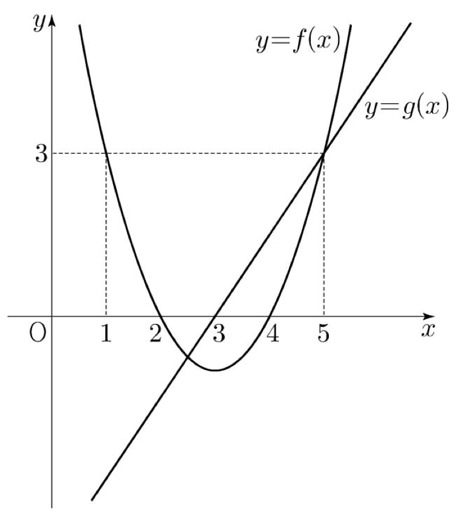
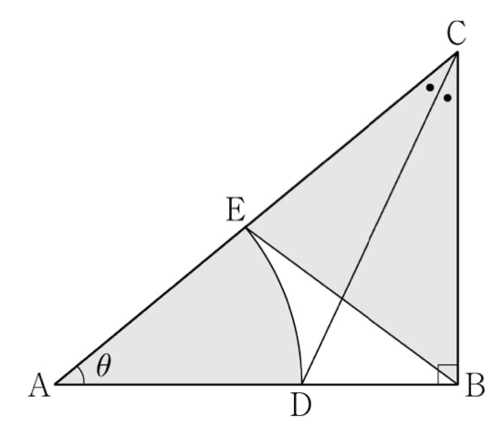
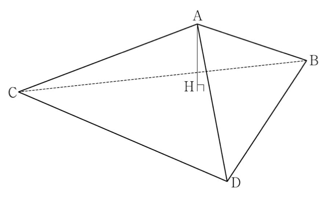
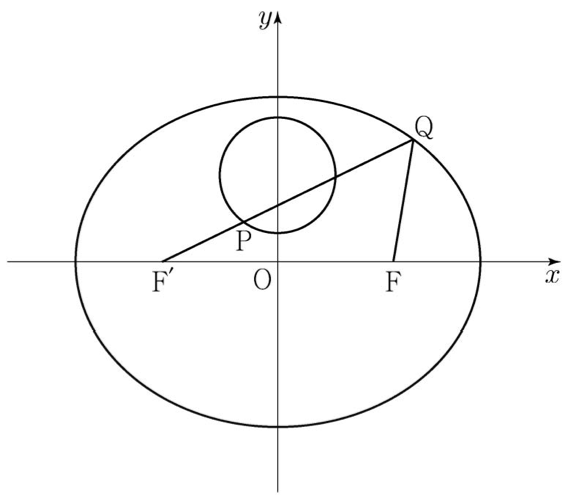

## 2019학년도 대학수학능력시험 수학 영역 문제 및 해설

  아래 문제의 저작권은 한국교육과정평가원에 있습니다. 필자는 비영리 교육 목적으로 해설을 작성하였음을 미리 밝힙니다.

  궁금한 점이나 잘못된 점이 있으시면 댓글로 남겨주세요. 빠르게 응답하겠습니다 :)

### 5지선다형

> #### Problem 1
>
>  두 벡터 $\overrightarrow{a} = (1, -2)$, $\overrightarrow{b} = (-1, 4)$에 대하여 벡터 $\overrightarrow{a} + 2\overrightarrow{b}$의 모든 성분의 합은? [2점]
>
> [1] $1$ [2] $2$ [3] $3$ [4] $4$ [5] $5$

> #### Solution 1
>
>  $\overrightarrow{a} + 2\overrightarrow{b} = (1 + 2 \times (-1), -2 + 2 \times 4) = (-1, 6)$ 이므로
> 모든 성분을 더하면 $-1 + 6 = 5$이다.
>
> 답 : [5] $5$

> #### Problem 2
>
>  $\lim_{x \to 0} \frac{x^2 + 5x}{\ln{(1 + 3x)}}$의 값은? [2점]
>
> [1] $\frac{7}{3}$ [2] $2$ [3] $\frac{5}{3}$ [4] $\frac{4}{3}$ [5] $1$

> #### Solution 2
>
>  $\lim_{x \to 0} \frac{\ln{(1 + ax)}}{x} = a$임을 알고 있으므로 주어진 식의 분모와 분자를 $x$로 나누어 보자. 그러면,
>
> $$\lim_{x \to 0} \dfrac{\frac{x^2 + 5x}{x}}{\frac{\ln{(1 + 3x)}}{x}} = \lim_{x \to 0} \frac{x + 5}{3} = \frac{5}{3}$$
>
> 이다.
>
> 답 : [3] $\frac{5}{3}$

> #### Problem 3
>
>  좌표공간의 두 점 $\mathrm{A}(2, a, -2)$, $\mathrm{B}(5, -2, 1)$에 대하여 선분 $\mathrm{AB}$를 $2 : 1$로 내분하는 점이 $x$축 위에 있을 때, $a$의 값은? [2점]
>
> [1] $1$ [2] $2$ [3] $3$ [4] $4$ [5] $5$

> #### Solution 3
>
>  좌표공간에서 점 $\mathrm{P}(x_1, y_1, z_1)$, $\mathrm{Q}(x_2, y_2, z_2)$에 대하여 선분 $\mathrm{PQ}$을 $m : n$으로 내분하는 점은
>
> $$\left(\frac{mx_2 + nx_1}{m + n}, \frac{my_2 + ny_1}{m + n}, \frac{mz_2 + nz_1}{m + n}\right)$$
>
> 이므로, 이를 적용하면
>
> $$\left(\frac{2 \times 5 + 2}{3}, \frac{2 \times (-2) + a}{3}, \frac{2 \times 1 + (-2)}{3}\right) = \left(4, \frac{a - 4}{3}, 0\right)$$
>
> 이 된다. 
>
>   이 점이 $x$축 위에 있다고 하였으므로, $a - 4 = 0$이 되어야 한다. 따라서, $a = 4$이다.
>
> 답 : [4] $4$

> #### Problem 4
>
>  두 사건 $A$, $B$에 대하여 $A$와 $B^C$은 서로 배반사건이고 
>
> $$\mathrm{P}(A) = \frac{1}{3}, \, \, \mathrm{P}(A^C \cap B) = \frac{1}{6}$$
> 
> 일 때, $\mathrm{P}(B)$의 값은? (단, $A^C$는 $A$의 여사건이다.) [3점]
>
> [1] $\frac{5}{12}$ [2] $\frac{1}{2}$ [3] $\frac{7}{12}$ [4] $\frac{2}{3}$ [5] $\frac{3}{4}$

> #### Solution 4
>
>  사건 $A$, $B^C$가 배반사건이라 하였으므로 $A \subset B$라고 할 수 있다. 또한 드 모르간의 법칙에 의해 $A^C \cap B = B - A$라고 둘 수 있으므로 $\mathrm{P}(A^C \cap B) = \mathrm{P}(B - A) = \frac{1}{6}$이 된다. 이 두 정보를 이용하여 다음과 같이 벤 다이어그램을 그릴 수 있다.
> 
> {:height="50%" width="50%"}
>
>  따라서, $\mathrm{P}(B) = \mathrm{P}(A) + \mathrm{P}(B - A) = \frac{1}{3} + \frac{1}{6} = \frac{1}{2}$ 이다.
>
> 답 : [2] $\frac{1}{2}$

> #### Problem 5
>
>  함수 $y = 2^x + 2$의 그래프를 $x$축의 방향으로 $m$만큼 평행이동한 그래프가 함수 $y = \log_{2} 8x$의 그래프를 $x$축의 방향으로 $2$만큼 평행이동한 그래프와 직선 $y = x$에 대하여 대칭일 때, 상수 $m$의 값은? [3점]
>
> [1] $1$ [2] $2$ [3] $3$ [4] $4$ [5] $5$

> #### Solution 5
>
>  $y = 2^x + 2$의 그래프를 $x$축의 방향으로 $m$만큼 평행이동한 그래프는 $y = 2^{x - m} + 2$로 표현할 수 있다. 그리고 $y = \log_{2} 8x$의 그래프를 $x$축의 방향으로 $2$만큼 평행이동한 그래프는 $y = \log_{2} 8(x - 2) = \log_{2} (x - 2) + 3$으로 표현할 수 있다. 따라서 이 두 그래프가 직선 $y = x$에 대해 대칭이라는 것을 이용해 $m = 3$임을 알 수 있다.
>
> 답 : [3] $3$

> #### Problem 6
>
>  초점이 $\mathrm{F}$인 포물선 $y^2 = 12x$ 위의 점 $\mathrm{P}$에 대하여 $\overline{\mathrm{PF}} = 9$일 때, 점 $\mathrm{P}$의 $x$좌표는? [3점]
>
> [1] $6$ [2] $\frac{13}{2}$ [3] $7$ [4] $\frac{15}{2}$ [5] $8$

> #### Problem 7
>
>  곡선 $e^x - xe^y = y$ 위의 점 $(0, 1)$에서의 접선의 기울기는? [3점]
>
> [1] $3 - e$ [2] $2 - e$ [3] $1 - e$ [4] $-e$ [5] $-1 - e$

> #### Problem 8
>
>  확률변수 $X$가 이항분포 $\mathrm{B}\left(n, \frac{1}{2}\right)$를 따르고 $\mathrm{E}(X^2) = \mathrm{V}(X) + 25$를 만족시킬 때, $n$의 값은? [3점]
>
> [1] $10$ [2] $12$ [3] $14$ [4] $16$ [5] $18$ 

> #### Problem 9
>
>  함수 $f(x) = \frac{1}{1 + e^{-x}}$의 역함수를 $g(x)$라 할 때, $g'(f(-1))$의 값은? [3점]
>
> [1] $\frac{1}{(1 + e)^2}$ [2] $\frac{e}{1 + e}$ [3] $\left(\frac{1 + e}{e}\right)^2$ [4] $\frac{e^2}{1 + e}$ [5] $\frac{(1 + e)^2}{e}$

> #### Problem 10
>
>  주머니 속에 $2$부터 $8$까지의 자연수가 각각 하나씩 적힌 구슬 7개가 들어 있다. 이 주머니에서 임의로 $2$개의 구슬을 동시에 꺼낼 때, 꺼낸 구슬에 적힌 두 자연수가 서로소일 확률은? [3점]
>
> [1] $\frac{8}{21}$ [2] $\frac{10}{21}$ [3] $\frac{4}{7}$ [4] $\frac{2}{3}$ [5] $\frac{16}{21}$

> #### Problem 11
>
>  $0 \le \theta < 2\pi$일 때, $x$에 대한 이차방정식
>
> $$6x^2 + (4\cos\theta)x + \sin\theta = 0$$
>
> 이 실근을 갖지 않도록 하는 모든 $\theta$의 값의 범위는 $\alpha < \theta < \beta$이다. $3\alpha + \beta$의 값은? [3점]
>
> [1] $\frac{5}{6}\pi$ [2] $\pi$ [3] $\frac{7}{6}\pi$ [4] $\frac{4}{3}\pi$ [5] $\frac{3}{2}\pi$

> #### Problem 12
>
>  네 명의 학생 $\mathrm{A}$, $\mathrm{B}$, $\mathrm{C}$, $\mathrm{D}$에게 같은 종류의 초콜릿 $8$개를 다음 규칙에 따라 남김없이 나누어 주는 경우의 수는? [3점]
>
> > (가) 각 학생은 적어도 $1$개의 초콜릿을 받는다.
> >
> > (나) 학생 $\mathrm{A}$는 학생 $\mathrm{B}$보다 더 많은 초콜릿을 받는다.
>
> [1] $11$ [2] $13$ [3] $15$ [4] $17$ [5] $19$

> #### Problem 13
>
>  좌표공간에서 점 $(2, 0, 5)$를 지나고 직선 $x - 1 = 2 - y = \frac{z + 1}{2}$을 포함하는 평면이 $x$축과 만나는 점의 $x$좌표는? [3점]
>
> [1] $\frac{9}{2}$ [2] $4$ [3] $\frac{7}{2}$ [4] $3$ [5] $\frac{5}{2}$

> #### Problem 14
>
>  이차함수 $y = f(x)$의 그래프와 일차함수 $y = g(x)$의 그래프가 그림과 같을 때, 부등식
>
> $$ \left(\frac{1}{2}\right)^{f(x)g(x)} \ge \left(\frac{1}{8}\right)^{g(x)}$$
>
> 을 만족시키는 모든 자연수 $x$의 값의 합은? [4점]
>
> {: height="50%" width="50%"}
>
> [1] $7$ [2] $9$ [3] $11$ [4] $13$ [5] $15$

> #### Problem 15
>
>  어느 회사 직원들의 어느 날의 출근 시간은 평균이 $66.4$분, 표준편차가 $15$분인 정규분포를 따른다고 한다. 이 날 출근 시간이 $73$분 이상인 직원들 중에서 $40$%, $73$분 미만인 직원들 중에서 $20$%가 지하철을 이용하였고, 나머지 직원들은 다른 교통수단을 이용하였다. 이 날 출근한 이 회사 직원들 중 임의로 선택한 $1$명이 지하철을 이용하였을 확률은? (단, $Z$가 표준정규분포를 따르는 확률변수일 때, $\mathrm{P}(0 \le Z \le 0.44) = 0.17$로 계산한다.) [4점]
>
> [1] $0.306$ [2] $0.296$ [3] $0.286$ [4] $0.276$ [5] $0.266$

> #### Problem 16
>
>  $x > 0$에서 정의된 연속함수 $f(x)$가 모든 양수 $x$에 대하여
>
> $$2f(x) + \frac{1}{x^2}f\left(\frac{1}{x}\right) = \frac{1}{x} + \frac{1}{x^2}$$
>
> 을 만족시킬 때, $\int^{2}_{\frac{1}{2}} f(x) dx$의 값은? [4점]
>
> [1] $\frac{\ln 2}{3} + \frac{1}{2}$ [2] $\frac{2\ln 2}{3} + \frac{1}{2}$ [3] $\frac{\ln 2}{3} + 1$ [4] $\frac{2\ln 2}{3} + 1$ [5] $\frac{2\ln 2}{3} + \frac{3}{2}$

> #### Problem 17
>
>  다음은 집합 $X = \\{1, 2, 3, 4, 5, 6\\}$과 함수 $f : X \rightarrow X$에 대하여 합성함수 $f \circ f\,$의 치역의 원소의 개수가 $5$인 함수 $f\,$의 개수를 구하는 과정이다.
>
> > 함수 $f\,$와 함수 $f \circ f\,$의 치역을 각각 $A$와 $B$라 하자.
> >
> > $n(A) = 6$이면 함수 $f\,$는 일대일 대응이고, 함수 $f \circ f\,$도 일대일 대응이므로 $n(B) = 6$이다.
> >
> > 또한 $n(A) \le 4$이면 $B \subset A$이므로 $n(B) \le 4$이다.
> >
> > 그러므로 $n(A) = 5$, 즉 $B = A$인 경우만 생각하면 된다.
> >
> >  
> >
> > (i) $n(A) = 5$인 $X$의 부분집합 $A$를 선택하는 경우의 수는 $\fbox{   (가)   }$이다.
> >
> > (ii) (i)에서 선택한 집합 $A$에 대하여, $X$의 원소 중 $A$에 속하지 않는 원소를 $k$라 하자.
> >
> > $n(A) = 5$이므로 집합 $A$에서 $f(k)$를 선택하는 경우의 수는 $\fbox{   (나)   }$이다.
> >
> > (iii) (i)에서 선택한 $A = \\{a_1, a_2, a_3, a_4, a_5\\}$와 (ii)에서 선택한 $f(k)$에 대하여, $f(k) \in A$이며 $A = B$이므로 
> >
> > $$A = \{f(a_1), f(a_2), f(a_3), f(a_4), f(a_5)\} \cdots \textrm{(*)}$$
> >
> > 이다. (*)을 만족시키는 경우의 수는 집합 $A$에서 집합 $A$로의 일대일 대응의 개수와 같으므로 $\fbox{   (다)   }$이다.
> >
> > 따라서, (i), (ii), (iii)에 의하여 구하는 함수 $f\,$의 개수는 $\fbox{   (가)   } \times \fbox{   (나)   } \times \fbox{   (다)   }$이다.
>
> 위의 (가), (나), (다)에 알맞은 수를 각각 $p$, $q$, $r$라 할 때, $p + q + r$의 값은? [4점]
>
> [1] $131$ [2] $136$ [3] $141$ [4] $146$ [5] $151$

> #### Problem 18
>
>  그림과 같이 $\overline{\mathrm{AB}} = 1$, $\angle\, \mathrm{B} = \frac{\pi}{2}$인 직각삼각형 $\mathrm{ABC}$에서 $\angle\,{\mathrm{C}}$를 이등분하는 직선과 선분 $\overline{\mathrm{AB}}$의 교점을 $\mathrm{D}$, 중심이 $\mathrm{A}$이고 반지름의 길이가 $\overline{\mathrm{AD}}$인 원과 선분 $\mathrm{AC}$의 교점을 $\mathrm{E}$라 하자. $\angle\, \mathrm{A} = \theta$일 때, 부채꼴 $\mathrm{ADE}$의 넓이를 $S(\theta)$, 삼각형 $\mathrm{BCE}$의 넓이를 $T(\theta)$라 하자. $\lim_{\theta \to 0+} \frac{\\{S(\theta)\\}^2}{T(\theta)}$의 값은? [4점]
>
> {: height="50%" width="50%"}
>
> [1] $\frac{1}{4}$ [2] $\frac{1}{2}$ [3] $\frac{3}{4}$ [4] $1$ [5] $\frac{5}{4}$

> #### Problem 19
>
>  한 변의 길이가 $12$인 정삼각형 $\mathrm{BCD}$를 한 면으로 하는 사면체 $\mathrm{ABCD}$의 꼭짓점 $\mathrm{A}$에서 평면 $\mathrm{BCD}$에 내린 수선의 발을 $\mathrm{H}$라 할 때, 점 $\mathrm{H}$는 삼각형 $\mathrm{BCD}$의 내부에 놓여 있다. 삼각형 $\mathrm{CDH}$의 넓이는 삼각형 $\mathrm{BCH}$의 넓이의 $3$배, 삼각형 $\mathrm{DBH}$의 넓이는 삼각형 $\mathrm{BCH}$의 넓이의 $2$배이고 $\overline{\mathrm{AH}} = 3$이다. 선분 $\mathrm{BD}$의 중점을 $\mathrm{M}$, 점 $\mathrm{A}$에서 선분 $\mathrm{CM}$에 내린 수선의 발을 $\mathrm{Q}$라 할 때, 선분 $\mathrm{AQ}$의 길이는? [4점]
>
> [1] $\sqrt{11}$ [2] $2\sqrt{3}$ [3] $\sqrt{13}$ [4] $\sqrt{14}$ [5] $\sqrt{15}$
>
> {:height="50%" width="50%"}

> #### Problem 20
>
>  점 $\left(-\frac{\pi}{2}, 0\right)$에서 곡선 $y = \sin x$ ($x > 0$)에 접선을 그어 접점의 $x$좌표를 작은 수부터 크기순으로 모두 나열할 때, $n$번째 수를 $a_n$이라 하자. 모든 자연수 $n$에 대하여 <보기>에서 옳은 것만을 있는 대로 고른 것은? [4점]
>
> > 
 < 보 기 > 

> >
> > ㄱ. $\tan a_n = a_n + \frac{\pi}{2}$
> >
> > ㄴ. $\tan a_{n + 2} - \tan a_n > 2\pi$
> >
> > ㄷ. $a_{n + 1} + a_{n + 2} > a_n + a_{n + 3}$
>
> [1] ㄱ [2] ㄱ, ㄴ [3] ㄱ, ㄷ [4] ㄴ, ㄷ [5] ㄱ, ㄴ, ㄷ

> #### Problem 21
>
>  실수 전체의 집합에서 미분가능한 함수 $f(x)$가 다음 조건을 만족시킬 때, $f(-1)$의 값은? [4점]
>
> > (가) 모든 실수 $x$에 대하여 $2\\{f(x)\\}^2f'(x) = \\{f(2x+1)\\}^2f'(2x+1)$이다.
> >
> > (나) $f\left(-\frac{1}{8}\right) = 1$, $f(6) = 2$
>
> [1] $\frac{\sqrt[3]{3}}{6}$ [2] $\frac{\sqrt[3]{3}}{3}$ [3] $\frac{\sqrt[3]{3}}{2}$ [4] $\frac{2\sqrt[3]{3}}{3}$ [5] $\frac{5\sqrt[3]{3}}{6}$

### 단답형

> #### Problem 22
>
>  $_{6}\mathrm{P}_2 - _{6} \\! \mathrm{C}_2$의 값을 구하시오. [3점]

> #### Problem 23
>
>  $\tan \theta = 5$일 때, $\sec^2 \theta$의 값을 구하시오. [3점]

> #### Problem 24
>
>  좌표평면 위를 움직이는 점 $\mathrm{P}$의 시각 $t$ ($t \ge 0$)에서의 위치 $(x, y)$가
>
> $$x = 1 - \cos 4t, \,\, y = \frac{1}{4}\sin 4t$$
>
> 이다. 점 $\mathrm{P}$의 속력이 최대일 때, 점 $\mathrm{P}$의 가속도의 크기를 구하시오. [3점]

> #### Problem 25
>
>  $\int^{\pi}_0 x \cos(\pi - x) dx$의 값을 구하시오. [3점]

> #### Problem 26
>
>  어느 지역 주민들의 하루 여가 활동 시간은 평균이 $m$분, 표준편차가 $\sigma$분인 정규분포를 따른다고 한다. 이 지역 주민 중 $16$명을 임의추출하여 구한 하루 여가 활동 시간의 표본평균이 $75$분일 때, 모평균 $m$에 대한 신뢰도 $95$%의 신뢰구간이 $a \le m \le b$이다. 이 지역 주민 중 $16$명을 다시 임의추출하여 구한 하루 여가 활동 시간의 표본평균이 $77$분일 때, 모평균 $m$에 대한 신뢰도 $99$%의 신뢰구간이 $c \le m \le d$이다. $d - b = 3.86$을 만족시키는 $\sigma$의 값을 구하시오. (단, $Z$가 표준정규분포를 따르는 확률변수일 때, $\mathrm{P}(\lvert Z \rvert \le 1.96) = 0.95$, $\mathrm{P}(\lvert Z \rvert \le 2.58) = 0.99$로 계산한다.) [4점]

> #### Problem 27
>
>  한 개의 주사위를 한 번 던진다. 홀수의 눈이 나오는 사건을 $A$, $6$ 이하의 자연수 $m$에 대하여 $m$의 약수의 눈이 나오는 사건을 $B$라 하자. 두 사건 $A$와 $B$가 서로 독립이 되도록 하는 모든 $m$의 값의 합을 구하시오. [4점]

> #### Problem 28
>
>  두 초점이 $\mathrm{F}$, $\mathrm{F'}$인 타원 $\frac{x^2}{49} + \frac{y^2}{33} = 1$이 있다. 원 $x^2 + (y - 3)^2 = 4$ 위의 점 $\mathrm{P}$에 대하여 직선 $\mathrm{F'P}$가 이 타원과 만나는 점 중 $y$좌표가 양수인 점을 $\mathrm{Q}$라 하자. $\overline{\mathrm{PQ}} + \overline{\mathrm{FQ}}$의 최댓값을 구하시오. [4점]
>
> {: height="50%" width="50%"}

> #### Problem 29
>
>  좌표평면에서 넓이가 $9$인 삼각형 $\mathrm{ABC}$의 세 변 $\mathrm{AB}$, $\mathrm{BC}$, $\mathrm{CA}$ 위를 움직이는 점을 각각 $\mathrm{P}$, $\mathrm{Q}$, $\mathrm{R}$라 할 때,
>
> $$\overrightarrow{\mathrm{AX}} = \frac{1}{4}\left(\overrightarrow{\mathrm{AP}} + \overrightarrow{\mathrm{AR}} \right) + \frac{1}{2} \overrightarrow{\mathrm{AQ}}$$
>
> 를 만족시키는 점 $\mathrm{X}$가 나타내는 영역의 넓이가 $\frac{p}{q}$이다. $p + q$의 값을 구하시오. (단, $p$와 $q$는 서로소인 자연수이다.) [4점]

> #### Problem 30
>
>  최고차항의 계수가 $6\pi$인 삼차함수 $f(x)$에 대하여 함수 $g(x) = \frac{1}{2 + \sin (f(x))}$이 $x = \alpha$에서 극대 또는 극소이고, $\alpha \ge 0$인 모든 $\alpha$를 작은 수부터 크기순으로 나열한 것을 $\alpha_1$, $\alpha_2$, $\alpha_3$, $\alpha_4$, $\alpha_5$, $\cdots$ 라 할 때, $g(x)$는 다음 조건을 만족시킨다.
>
> > (가) $\alpha_1 = 0$이고, $g(\alpha_1) = \frac{2}{5}$이다.
> >
> > (나) $\frac{1}{g(\alpha_5)} = \frac{1}{g(\alpha_2)} + \frac{1}{2}$
>
> $g'(-\frac{1}{2}) = a\pi$라 할 때, $a^2$의 값을 구하시오. (단, $0 < f(0) < \frac{\pi}{2}$) [4점]