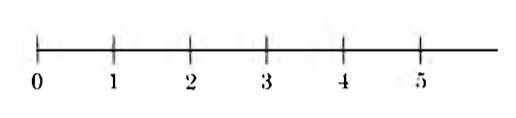

## The Integers

### 개념 요약

- 자연수
    + $0, 1, 2, \cdots$와 같이 수를 셀 때 사용하는 수이다. 특히, $1, 2, 3, \cdots$와 같이 $0$을 제외한 자연수를 양의 정수라고 한다.
    + 자연수는 다음과 같이 기하학적으로 표현할 수도 있다. 이렇게 수직선 상에 표현할 때는 $0$을 가리키는 지점을 원점이라고 한다.
    {:height="30%" width="30%"}

- 정수
    + 음의 정수란 양의 정수를 수직선 상에서 원점 대칭시킨 수이다. 표기할 때는 $-1, -2, -3, \cdots$와 같이 표기한다.
    + 양의 정수, $0$, 음의 정수를 모두 합하여 정수라고 한다.

- 덧셈의 역원
    + 어떤 수 $a$가 있다 하자. $a$와 합했을 때 $0$을 만드는 수를 $a$의 덧셈의 역원이라 한다. 일반적으로는 $-a$가 $a$의 덧셈의 역원이다.
    + (예시) $3 + (-3) = 0$이므로 $3$의 덧셈의 역원은 $-3$이다.

### 예제

- 모든 정수 $a$에 대하여 $0 + a = a + 0 = a$이 성립한다.

- 모든 정수 $a$에 대하여 $a + (-a) = 0$, $-a + a = 0$이 성립한다.

-

### 연습 문제

-
