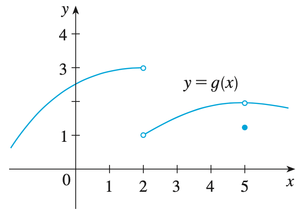

## The Limit of a Function

### 개념 요약

- Suppose $f(x)$ is defined when $x$ is near the number $a$. (This means that $f$ is defined on some open interval that contains $a$, except possibly at $a$ itself.) Then we write

    $$\lim_{x \to a} f(x) = L$$

    
and say “the limit of $f(x)$, as $x$ approaches $a$, equals $L$”

    if we can make the values of $f(x)$ arbitrarily close to $L$ (as close to $L$ as we like) by restricting $x$ to be suficiently close to $a$ (on either side of $a$) but not equal to $a$.

- We write 
    
    $$\lim_{x \to a^-} f(x) =L$$

    and say the left-hand limit of $f(x)$ as $x$ approaches $a$ [or the limit of $f(x)$ as $x$ approaches $a$ from the left] is equal to $L$ if we can make the values of $f(x)$ arbitrarily close to $L$ by taking $x$ to be sufficiently close to $a$ with $x$ less than $a$.
    
- We write 
    
    $$\lim_{x \to a^+} f(x) =L$$

    and say the right-hand limit of $f(x)$ as $x$ approaches $a$ [or the limit of $f(x)$ as $x$ approaches $a$ from the right] is equal to $L$ if we can make the values of $f(x)$ arbitrarily close to $L$ by taking $x$ to be sufficiently close to $a$ with $x$ greater than $a$. 

- Note that

    $$\lim_{x \to a} f(x) = L \quad \text{if and only if} \quad \lim_{x \to a^-} f(x) = L \quad \text{and} \quad \lim_{x \to a^+} f(x) = L$$

- Let $f$ be a function defined on both sides of $a$, except possibly at $a$ itself. Then

    $$\lim_{x \to a} f(x) = \infty$$

    means that the values of $f(x)$ can be made arbitrarily large (as large as we please) by taking $x$ sufficiently close to $a$, but not equal to $a$.

- Let $f$ be a function defined on both sides of $a$, except possibly at $a$ itself. Then

    $$\lim_{x \to a} f(x) = -\infty$$

    means that the values of $f(x)$ can be made arbitrarily large negative by taking $x$ sufficiently close to $a$, but not equal to $a$.

- The vertical line $x = a$ is called a vertical asymptote of the curve $y = f(x)$ if at least one of the following statements is true:

    $$\lim_{x \to a} f(x) = \infty \quad \lim_{x \to a^-} f(x) = \infty \quad \lim_{x \to a^+} f(x) = \infty$$

    $$\lim_{x \to a} f(x) = -\infty \quad \lim_{x \to a^-} f(x) = -\infty \quad \lim_{x \to a^+} f(x) = -\infty$$

### 예제

> #### Example 1. Guess the value of $\lim_{x \to 0} \frac{\sin x}{x}$ 
>
> 함수 $f(x) = \frac{\sin x}{x}$에 $0$과 가까운 값들을 집어넣으며 그 경향성을 알아보자.
>
> $$f(0.500) = 0.959 \quad f(0.250) = 0.990 \quad f(0.125) = 0.997$$
>
> $$f(-0.500) = -0.959 \quad f(-0.250) = -0.990 \quad f(-0.125) = -0.997$$
>
> $x$가 $0$에 가까워질수록 $f(x)$의 값은 $1$로 다가가므로 $\lim_{x \to 0} \frac{\sin x}{x} = 1$이다.
>
> 이를 확인해보기 위해 $f(x)$의 그래프를 그려보자.
>
> {:height="25%" width="25%"}
>
> 그래프를 통해 우리의 추측이 맞음을 알 수 있다.

> #### Example 2. Investigate $\lim_{x \to 0} \sin \frac{\pi}{x}$.
>
> 마찬가지로, 함수 $f(x) = \sin \frac{\pi}{x}$에 $0$과 가까운 값들을 집어넣으며 경향성을 알아보자.
>
> $$f(0.500) = 0.000 \quad f(0.250) = 0.000 \quad f(0.125) = 0.000$$
>
> $$f(-0.500) = 0.000 \quad f(-0.250) = 0.000 \quad f(-0.125) = 0.000$$
>
> $x$를 $0$에 접근시켰음에도 $f(x)$의 값은 항상 $0$이므로 $\lim_{x \to 0} \sin \frac{\pi}{x} = 0$이라 생각할 수 있다.
>
> 하지만, $f(x)$의 그래프를 그리면 이 추측이 틀렸음을 알 수 있다.
>
> {:height="50%" width="50%"}
>
> 그래프를 확인한 결과, $x$가 $0$에 다가갈수록 그래프는 $1$에서 $-1$까지 더 빠르게 진동한다. $f(x)$가 하나의 숫자로 다가가고 있지 않으므로 $\lim_{x \to 0} \sin \frac{\pi}{x}$는 존재하지 않는다.

> #### Example 3. The Heaviside function $H$ is defined by
>
> \begin{align\*}H(t) = \begin{cases} 0 & \text{if } t \lt 0 \\\\ 1 & \text{if } t \ge 0 \end{cases}. \end{align\*}
>
> #### Investigate $\lim_{t \to 0} H(t)$.
>
> $t$를 $0$의 왼편($0$보다 작은 쪽)에서 접근시켰을 때는 $H(t)$의 값이 $0$이지만, $t$를 $0$의 오른편($0$보다 큰 쪽)에서 접근시켰을 때는 $H(t)$의 값이 $1$이 되므로 $t$를 $0$으로 접근시켰을 때 $H(t)$의 값이 하나로 모아지지 않는다. 따라서, $\lim_{t \to 0} H(t)$는 존재하지 않는다. 함수의 개형은 다음의 그래프를 참조하자.
>
> {:height="25%" width="25%"}

> #### Example 4. The graph of a function $g$ is shown in below graph. Use it to state the values (if they exist) of the following:
>
> $$ \text{(a) } \lim_{x \to 2^-} g(x) \quad \text{(b) } \lim_{x \to 2^+} g(x) \quad \text{(c) } \lim_{x \to 2} g(x)$$
>
> $$ \text{(d) } \lim_{x \to 5^-} g(x) \quad \text{(e) } \lim_{x \to 5^+} g(x) \quad \text{(f) } \lim_{x \to 5} g(x)$$
>
> {:height="25%" width="25%"}
>
> (a) 위 그래프에서 $x$가 $2$의 왼편에서 다가올 때의 값이 $3$이므로 $\lim_{x \to 2^-} g(x) = 3$이다.
>
> (b) 위 그래프에서 $x$가 $2$의 오른편에서 다가올 때의 값이 $1$이므로 $\lim_{x \to 2^+} g(x) = 1$이다.
>
> (c) $\lim_{x \to 2^-} g(x) \ne \lim_{x \to 2^+} g(x)$이므로 $\lim_{x \to 2} g(x)$는 존재하지 않는다.
>
> (d) 위 그래프에서 $x$가 $5$의 왼편에서 다가올 때의 값이 $2$이므로 $\lim_{x \to 5^-} g(x) = 2$이다.
>
> (e) 위 그래프에서 $x$가 $5$의 오른편에서 다가올 때의 값이 $2$이므로 $\lim_{x \to 5^+} g(x) = 2$이다.
>
> (f) $\lim_{x \to 5^-} g(x) = \lim_{x \to 5^+} g(x) = 2$이므로 $\lim_{x \to 2} g(x) = 2$이다.

> #### Example 5. Find $\lim_{x \to 0} \frac{1}{x^2}$ if it exists.
>
> 함수 $f(x) = \frac{1}{x^2}$에 $0$과 가까운 값들을 집어넣으며 경향성을 알아보자.
>
> $$f(0.500) = 4.00 \quad f(0.250) = 16.0 \quad f(0.125) = 64.0$$
>
> $$f(-0.500) = 4.00 \quad f(-0.250) = 16.0 \quad f(-0.125) = 64.0$$
>
> $x$를 $0$에 가깝게 할수록 그 값은 멈춤 없이 계속하여 커진다. 따라서 $\lim_{x \to 0} \frac{1}{x^2}$은 존재하지 않을 것이다.
>
> 이를 확인해보기 위해 $f(x)$의 그래프를 그려보자.
>
> {:height="25%" width="25%"}
>
> 그래프를 통해 우리의 추측이 맞음을 알 수 있다.
>
> (참고로, $\lim_{x \to 0} \frac{1}{x^2} = \infty$라고도 쓸 수 있다.)

> #### Example 6. Find the vertical asymptotes of $f(x) = \tan x$.
>
> $\tan x = \frac{\sin x}{\cos x}$이다. $\cos x$는 $x = \frac{\pi}{2}$에서 $0$을 값으로 갖는다. $x = \frac{\pi}{2}$의 왼편에서는 $0$보다는 약간 큰 값을 가지는데, $\sin x$는 $\frac{\pi}{2}$에서 1을 값으로 가지므로 $\tan x$는 $x = \frac{\pi}{2}$으로 다가갈수록 그 값이 끝없이 커질 것이다. 따라서, $\lim_{x \to \frac{\pi}{2}^-} \tan x = \infty$이다. 마찬가지로, $\cos x$는 $x = \frac{\pi}{2}$의 오른편에서 $0$보다는 약간 작은 값을 갖고 $\sin x$는 마찬가지로 $1$이므로 $\tan x$의 값이 끝없이 작아질 것이다. 따라서, $\lim_{x \to \frac{\pi}{2}^+} \tan x = -\infty$이다. 이렇게 $x = \frac{\pi}{2}$에서 $\tan x$는 좌극한, 우극한 각각 양, 음의 무한대로 발산하므로 $x = \frac{\pi}{2}$에서 $y= \tan x$는 수직 점근선을 갖는다. 비슷한 방법으로 조사하면, $x = n\pi + \frac{\pi}{2}$($n$은 정수이다.)에서 점근선을 가짐을 알 수 있다.
>
> 아래의 그래프를 통해 위의 사실을 다시 확인할 수 있다.
>
> {:height="25%" width="25%"}

### 연습 문제