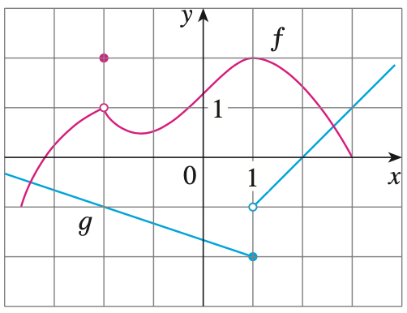

## Calculating Limits Using the Limit Laws

### 개념 요약

 - Suppose that $c$ is a constant and the limits

    $$\lim_{x \to a} f(x) \quad \text{and} \quad \lim_{x \to a} g(x)$$

    exist. Then

    $$\text{1. } \lim_{x \to a} [f(x) + g(x)] = \lim_{x \to a} f(x) + \lim_{x \to a} g(x)$$

    $$\text{2. } \lim_{x \to a} [f(x) - g(x)] = \lim_{x \to a} f(x) - \lim_{x \to a} g(x)$$

    $$\text{3. } \lim_{x \to a} [cf(x)] = c \lim_{x \to a} f(x)$$

    $$\text{4. } \lim_{x \to a} [f(x) g(x)] = \lim_{x \to a} f(x) \cdot \lim_{x \to a} g(x)$$

    $$\text{5. } \lim_{x \to a} \frac{f(x)}{g(x)} = \frac{\lim\limits_{x \to a} f(x)}{\lim\limits_{x \to a} g(x)} \quad \text{if } \lim_{x \to a} g(x) \ne 0$$

- If we use the Law 4 repeatedly with $g(x) = f(x)$, we obtain the following law.
    
    $$\text{6. } \lim_{x \to a} \left[f(x) \right]^n = \left[\lim_{x \to a} f(x) \right]^n$$

- In applying these six limit laws, we need to use two special limits:

    $$\text{7. } \lim_{x \to a} c = c \qquad \qquad \text{8. } \lim_{x \to a} x = a$$ 

- If we now put $f(x) = x$ in Law 6 and use Law 8, we get another useful special limit.

    $$\text{9. } \lim_{x \to a} x^n = a^n \quad \text{where } n \text{ is a positive integer}$$

    $$\text{10. } \lim_{x \to a} \sqrt[n]{x} = \sqrt[n]{a} \quad \text{where } n \text{ is a positive integer. if } n \text{ is even, we assume that } a > 0.$$

- More generally, we have the following law.

    $$\text{10. } \lim_{x \to a} \sqrt[n]{f(x)} = \sqrt[n]{\lim_{x \to a} f(x)} \quad \text{where } n \text{ is a positive integer. if } n \text{ is even, we assume that } \lim_{x \to a} f(x) > 0.$$

- If $f$ is a polynomial or a rational function and $a$ is in the domain of $f$, then

    $$\lim_{x \to a} f(x) = f(a)$$

- Note that

    $$\text{If } f(x) = g(x) \text{ when } x \ne a, \text{ then } \lim_{x \to a} f(x) = \lim_{x \to a} g(x), \text{ provided the limits exist.}$$

- If $f(x) \le g(x)$ when $x$ is near $a$ (except possibly at $a$) and the limits of $f$ and $g$ both exist as $x$ approaches $a$, then

    $$\lim_{x \to a} f(x) \le \lim_{x \to a} g(x)$$

- (The Squeeze Theorem) If $f(x) \le g(x) \le h(x)$ when $x$ is near $a$ (except possibly at $a$) and

    $$\lim_{x \to a} f(x) = \lim_{x \to a} h(x) = L$$

    $$\text{then} \quad \lim_{x \to a} g(x) = L$$

### 예제

> #### Example 1. Use the Limit Laws and the graphs of $f$ and $g$ in given graph to evaluate the following limits, if they exist.
>
> $$\text{(a) } \lim_{x \to -2} [f(x) + 5g(x)] \quad \text{(b) } \lim_{x \to 1} [f(x) g(x)] \quad \text{(c) } \lim_{x \to 2} \frac{f(x)}{g(x)}$$
>
> {:height="25%" width="25%"}
>
> (a) $\lim_{x \to -2} f(x) = 1$이고 $\lim_{x \to -2} g(x) = -1$이므로 
>
> \begin{align\*} \lim_{x \to -2} [f(x) + 5g(x)] &= \lim_{x \to -2} f(x) + \lim_{x \to -2} 5g(x) \\\\ 
&= \lim_{x \to -2} f(x) + \lim_{x \to -2} 5g(x) \\\\ 
&= \lim_{x \to -2} f(x) + 5\lim_{x \to -2} g(x) \\\\ 
&= 1 + 5 \times (-1) = -4. \end{align\*}
>
> (b) $\lim_{x \to 1} f(x) = 2$이고 $\lim_{x \to 1} g(x)$은 좌극한과 우극한이 다르다. $\lim_{x \to 1} f(x) \ne 0$이므로 $\lim_{x \to 1^+} g(x)$와 $\lim_{x \to 1^-} g(x)$에 $\lim_{x \to 1} f(x)$를 곱해주어도 둘의 값은 다를 것이다. 따라서,
>
> $$\lim_{x \to 1} [f(x) g(x)] \text{ does not exist.}$$
>
> (c) $1 < \lim_{x \to 2} f(x) < 2$이고 $\lim_{x \to 2} g(x) = 0$이다. 분모가 $0$인 경우엔 연산 법칙을 사용할 수 없다. 또한, 분자가 $0$이 아닌 실수이므로 극한이 존재하지 않는다.
>
> $$\lim_{x \to 2} \frac{f(x)}{g(x)} \text{ does not exist.}$$

> #### Example 2. Find $\lim_{x \to 1} \frac{x^2 - 1}{x - 1}$.
>
> 함수 $f(x) = \frac{x^2 - 1}{x - 1}$라 할 때, $\lim_{x \to 1} f(x)$는 $f(x)$의 분모가 $x = 1$일 때 $0$이므로 연산 법칙을 적용할 수 없는 것처럼 보인다. 하지만, $x^2 - 1 = (x - 1)(x + 1)$이라는 점을 이용해서 약분하게 되면
>
> $$\lim_{x \to 1} \frac{x^2 - 1}{x - 1} = \lim_{x \to 1} \frac{(x - 1)(x + 1)}{x - 1} = \lim_{x \to 1} \frac{\cancel{(x - 1)}(x + 1)}{\cancel{x - 1}} = \lim_{x \to 1} (x + 1) = 2$$
>
> 이다.

> #### Example 3. Find $\lim_{x to 1} g(x)$ where
>
> \begin{align\*}g(x) = \begin{cases} x + 1 & \text{if } x \ne 1 \\\\ 
 \pi & \text{if } x = 1 \end{cases}. \end{align\*}
>
> 비록 $g(1) = \pi$이지만, 극한의 정의를 잘 생각해보면 그 점의 값은 별로 중요하지 않다는 것을 상기할 수 있다. 따라서, 별 문제 없이 
>
> $$\lim_{x \to 1} g(x) = \lim_{x \to 1} (x + 1) = 2$$
>
> 임을 알 수 있다.

> #### Example 4. Show that $\lim_{x \to 0} x^2 \sin \frac{1}{x} = 0$
>
> $\lim_{x \to 0} x^2 \lim_{x \to 0} \sin \frac{1}{x}$로 생각해서 풀고 싶지만, $\lim_{x \to 0} \sin \frac{1}{x}$의 값이 존재하지 않으므로, 다른 방법을 사용해야 한다.
> 
> Squeeze Theorem을 사용해보자. $-1 \le \sin \frac{1}{x} \le 1$이므로 부등식 전체에 $x^2$을 곱하면 
>
> $$-x^2 \le x^2 \sin \frac{1}{x} \le x^2$$
>
> 따라서, Sqeeze Theorem을 적용하면, $-x^2$과 $x^2$ 모두 $x \to 0$일 때 그 극한값이 $0$이므로 $\lim_{x \to 0} x^2 \sin \frac{1}{x} = 0$이다.