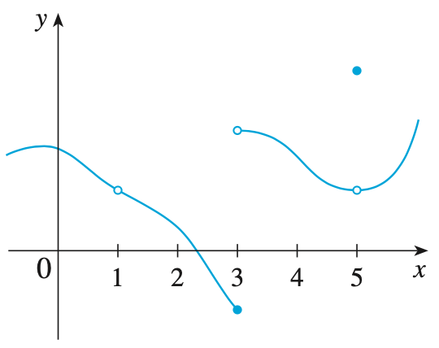
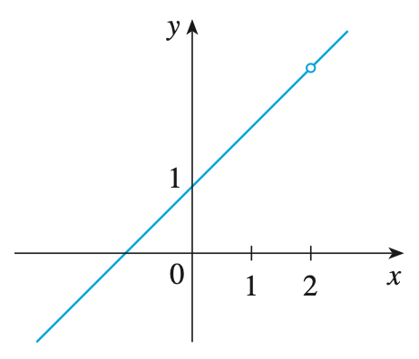
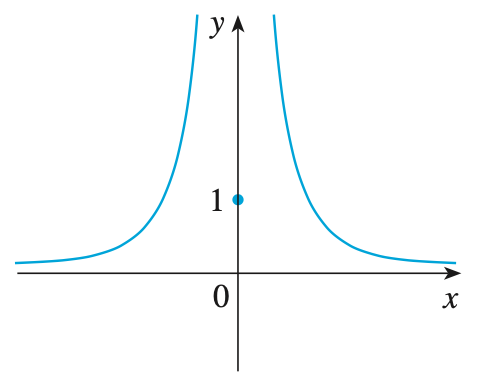
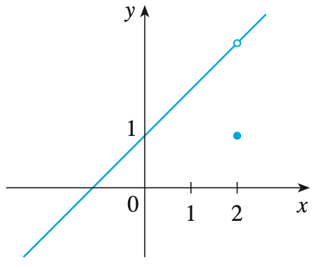
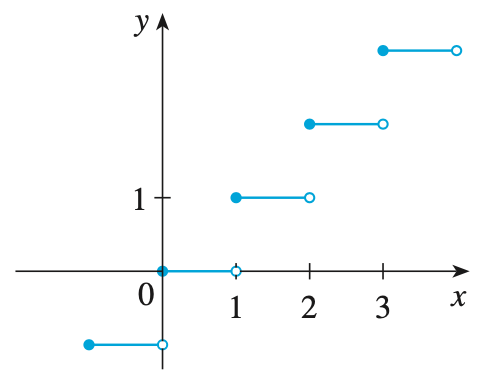

## Continuity

### 개념 요약

- A function $f$ is continuous at a number $a$ if

    $$\lim_{x \to a} f(x) = f(a)$$

- A function $f$ is continuous from the right at a number $a$ if

    $$\lim_{x \to a^+} f(x) = f(a)$$

    and $f$ is continuous from the left at a number $a$ if

    $$\lim_{x \to a^-} f(x) = f(a)$$

- A function $f$ is continuous on an interval if it is continuous at every number in the interval. (If $f$ is defined only on one side of an endpoint of the interval, we understand continuous at the endpoint to mean continuous from the right or continuous from the left.)

- If $f$ and $g$ are continuous at $a$ and $c$ is a constant, then the following functions are also continuous at $a$:

    $$ f + g, \quad f - g, \quad cf, \quad fg, \quad \frac{f}{g} \ \text{ if } g(a) \ne 0$$

- The following types of functions are continuous at every number in their domains:

    polynomials, rational functions, root functions, trigonometric functions, inverse trigonometric functions, exponential functions, logarithmic functions

- If $f$ is continuous at $b$ and $\lim_{x \to a} g(x) = b$, then $\lim_{x \to a} f(g(x)) = f(b)$. In other words,

    $$\lim_{x \to a} f(g(x)) = f \left( \lim_{x \to a} g(x) \right)$$

- If $g$ is continuous at $a$ and $f$ is continuous at $g(a)$, then the composite function $f \circ g$ given by $(f \circ g)(x) = f(g(x))$ is continuous at $a$.

- (The Intermediate Value Theorem) Suppose that $f$ is continuous on the closed interval $[a, b]$ and let $N$ be any number between $f(a)$ and $f(b)$, where $f(a) \ne f(b)$. Then there exists a number $c$ in $(a, b)$ such that $f(c) = N$.

### 예제

> #### Example 1. Below graph shows the graph of a function $f$. At which numbers is $f$ discontinuous? Why?
>
> {:height="25%" width="25%"}
>
> 함수 $f$에 대하여 점 $a$에서의 연속의 조건은 
>
> 1. $f(a)$가 정의되어야 한다.
> 2. $\lim_{x \to a} f(x)$가 존재해야 한다.
> 3. 점 $a$에서의 극한값과 함숫값이 같아야 한다.
>
> 이다. 그런데 위 그래프를 보면 $x = 1$에서 함숫값이 존재하지 않으므로 $x = 1$에서 불연속이다. 또, $x = 3$에서 좌극한과 우극한이 불일치하여 극한값이 존재하지 않으므로 $x = 3$에서도 불연속이다. 마지막으로, $x = 5$에서 극한값과 함숫값이 불일치하므로 불연속이다.

> #### Example 2. Where are each of the following functions discontinuous?
>
> | (a) | $f(x) = \frac{x^2 - x - 2}{x - 2}$ | (b) | \begin{align\*}f(x) = \begin{cases} \frac{1}{x^2} & \text{if } x \ne 0 \\\\ 1 & \text{if } x = 0 \end{cases} \end{align\*} |
> | (c) | \begin{align\*}f(x) = \begin{cases} \frac{x^2 - x - 2}{x - 2} & \text{if } x \ne 2 \\\\ 1 & \text{if } x = 2 \end{cases} \end{align\*} | (d) | $f(x) = [x]$ |
> {:.transtable}
>
> (a) $f(2)$가 정의되지 않으므로 함수 $f$는 $x = 2$에서 불연속이다. 인수분해와 약분을 진행하면 $x = 2$를 제외하고 함수 $f$는 $x + 1$과 동일함을 알 수 있으므로 $x \ne 2$에서 함수 $f$는 연속임을 알 수 있다.
>
> (b) $f(0) = 1$이지만 $\lim_{x \to 0} f(x) = \infty$이 존재하지 않으므로 함수 $f$는 $x = 0$에서 불연속이다. 나머지 부분에서는 유리함수이므로 연속임이 자명하다.
>
> (c) $f(2)$는 정의되어 있으나
>
> $$\lim_{x \to 1} \frac{x^2 - x - 2}{x - 2} = \lim_{x \to 1} \frac{\cancel{(x - 2)}(x + 1)}{\cancel{(x - 2)}} = \lim_{x \to 1} (x + 1) = 2 \ne = 1 = f(2)$$
>
> 이므로 함수 $f$는 $x = 1$에서 불연속이다. (a)와 같은 이유로 나머지 부분에선 연속이다.
>
> (d) 최대 정수 함수 $[x]$는 $n$이 정수일 때,
>
> $$\lim_{x \to n^-} [x] = x - 1 \ne \lim_{x \to n^+} [x] = x$$
>
> 이므로 모든 정수에서 극한값이 존재하지 않는다. 따라서, 모든 정수에서 불연속이다.
>
>   
>
> (참고 사항)
>
> 다음은 위 예제의 함수들의 그래프이다.
>
> | (a) | {:height="30%" width="75%"} | (b) | {:height="30%" width="75%"} | (c) | {:height="30%" width="80%"} | (d) | {:height="30%" width="80%"} |
> {:.transtable}
>
> (a), (c)와 같이 한 점에서만 불연속인 경우를 __removable discontinuity__ 라 하고, (b)와 같이 그래프의 일부분이 양 혹은 음의 무한대로 발산하여 불연속인 경우는 __ininite discontinuity__ 라 한다. 마지막으로, (d)와 같이 함수가 어떤 한 점을 기준으로 양 옆의 개형이 점프하듯이 나눠질 때를 __jump discontinuity__ 라 한다.

> #### Example 3. Show that the function $f(x) = 1 - \sqrt{1 + x^2}$ is continuous on the interval $[-1, 1]$.
>
> 끝점인 $a = -1, \, 1$에서는 좌, 우 연속성을 보아야 하므로 잠시 미뤄두고 일단 $-1 \lt a \lt 1$에서의 연속성을 살펴보자.
>
> \begin{align\*} \lim_{x \to a} f(x) &= \lim_{x \to a} (1 - \sqrt{1 + x^2}) \\\\ 
&= 1 - \lim_{x \to a} \sqrt{1 + x^2} \\\\ 
&= 1 - \sqrt{\lim_{x \to a} (1 + x^2)} \\\\ 
&= 1 - (1 + a^2) \\\\ 
&= f(a) 
\end{align\*}
>
> 따라서, $(-1, 1)$에서 함수 $f(x)$는 연속이다. 비슷한 방법으로
>
> $$\lim_{x \to -1^+} f(x) = f(-1) \quad \text{and} \quad \lim_{x \to 1^-} f(x) = f(1)$$
>
> 임을 알 수 있으므로 $x = -1, \, 1$에서도 연속이다. 따라서, 함수 $f(x)$는 $[-1, 1]$에서 연속이다.

> #### Example 4. Show that there is a root of the equation
>
> $$4x^3 - 6x^2 + 3x - 2 = 0$$
>
> #### between $1$ and $2$.
>
> 함수 $f(x) = 4x^3 - 6x^2 + 3x - 2$가 $0$이 되는 $1 \lt c \lt 2$가 있다 하자. 사잇값 정리를 이용하기 위해 $a = 1, \, b = 2, \, N = 0$으로 잡자. 
>
> $$f(1) = 4 - 6 + 3 - 2 = -1 \lt 0$$
>
> $$f(2) = 32 - 24 + 6 - 2 = 12 \gt 0$$
>
> 따라서, 함수 $f(x)$가 $(1, 2)$에 $f(x) = 0$을 만족하는 $c$를 적어도 하나 가짐을 알 수 있고, 이는 곧 $f(x) = 0$인 방정식이 (1, 2) 사이에서 적어도 한 개의 근을 갖는다고 할 수 있다.