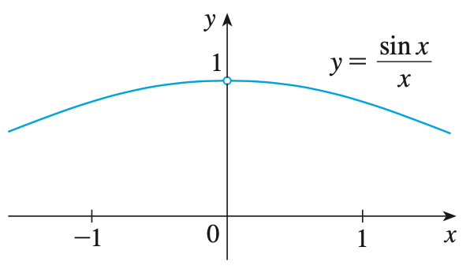
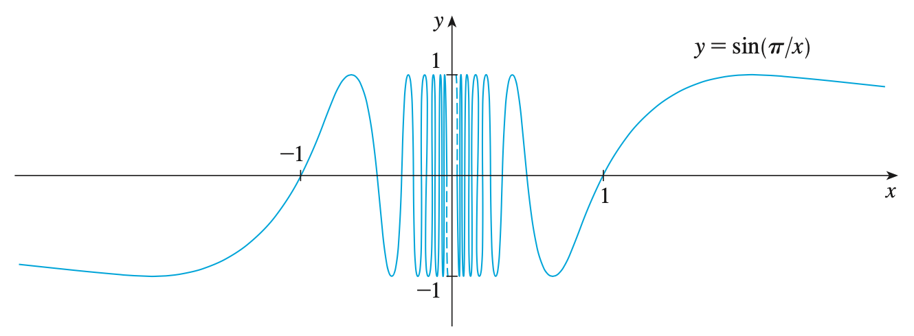
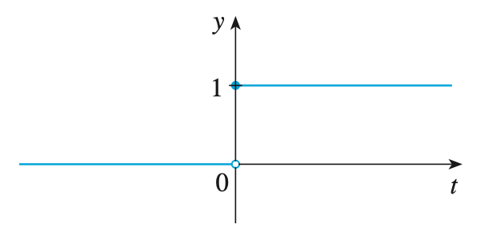

## The Limit of a Function

### 도입

  우리는 할선을 이루는 두 점을 가까이 접근시켜 접선을 대략적으로 추정할 수 있고, 어떤 구간에서의 평균 속도를 구간의 길이를 계속 줄여나가며 순간 속도를 추정할 수 있다. 이런 작업들을 수학적으로 표기하기 위해 극한이라는 개념이 등장하게 되었다. 극한의 등장으로 인해, 접선을 할선의 극한이라 할 수 있고, 순간 속도를 평균 속도의 극한이라 할 수 있게 되었다. 그렇다면 극한은 어떻게 계산할 수 있을까? 함수 $f(x) = x^2 - x + 2$를 예시로 들어보자. $x$가 $2$에 다가갈 때, 그 근방의 값들은 다음 표와 같다.

$x$ |$f(x)$ |$x$  |$f(x)$
----|-------|-----|------
1.00|2.00   |3.00 |8.00 
1.50|2.75   |2.50 |5.75
1.90|3.71   |2.10 |4.31
1.95|3.85   |2.05 |4.15
1.99|3.97   |2.01 |4.03

이를 통해 $x$가 $2$로 다가갈 때의 함수 $f(x)$의 극한을 $4$라 할 수 있다.

### 극한의 직관적 정의

  극한은 다음과 같이 직관적으로 정의할 수 있다.

>#### Definition (Intuitive Definition of a Limit)
> 
>  $a$ 근방의 열린 구간에서 정의된 함수 $f(x)$가 있다 하자. ($x = a$에서의 정의 여부는 상관 없다.) 만약 $x$를 $a$에 충분히 가까이 접근시킴으로써($x \ne a$) $f(x)$의 함숫값을 우리가 원하는 만큼 $L$에 가깝게 할 수 있다면 다음과 같이 표기한다.
>
>$$\lim_{x \to a} f(x) = L$$

다음의 예시를 통해 감을 잡아보자.

>#### Example 1
>
>  $\displaystyle{\lim_{x \to 1} \frac{x^2 - 1}{x - 1}}$의 값을 추정해보시오.
>
>#### Solution
>
>  우리는 $x$를 $1$에 다가가게 하고, 함숫값을 조사하여 함숫값의 경향성을 찾으면 될 것이다.
>
>$x$ |$f(x)$ |$x$  |$f(x)$
>----|-------|-----|------
>0.50|1.50   |1.50 |2.50 
>0.90|1.90   |1.10 |2.10
>0.95|1.95   |1.05 |2.05
>0.99|1.99   |1.01 |2.01
>
>위의 표로 미루어 보아, 
>
>$$\lim_{x \to 1} \dfrac{x^2 - 1}{x - 1} = 2$$
>
>이다.
>
>  그래프를 통해서도 극한값을 추정할 수 있다. 다음은 $y = \dfrac{x^2 - 1}{x - 1}$의 그래프이다.
>
>{:height="50%" width="50%"}
>
>그래프를 통해 $x$가 $1$에 가까이 갈 때 함숫값이 $2$에 접근한다는 것을 알 수 있을 것이다.

### 좌극한과 우극한

  아까 정의한 극한은 $x$가 $a$보다 작은 방향에서 접근하거나 큰 방향에서 접근할 때 모두를 일컬어 $x$가 $a$로 접근한다고 하였다. 그러나 함수 

$$H(x) = \begin{cases} 
          0 & \text{if} \quad x < 0 \\
          1 & \text{if} \quad x \ge 0
          \end{cases}}
$$

는 $x$가 $0$보다 큰 쪽과 $0$보다 작은 쪽의 함숫값이 서로 다르다. 이런 경우에는 극한을 어떻게 정의해야 할까? 그래서 우리는 좌극한과 우극한이라는 개념을 도입하기에 이르렀다. 좌극한과 우극한을 도입하면

$$\lim_{x \to 0^-} H(x) = 0, \qquad \lim_{x \to 0^+} H(x) = 1$$

이라 할 수 있다.

>#### Definition (Definition of One-Sided Limits)
> 
>  $a$ 근방의 열린 구간에서 정의된 함수 $f(x)$가 있다 하자. ($x = a$에서의 정의 여부는 상관 없다.) 만약 $x$를 $a$에 충분히 가까이 접근시킴으로써($x \ne a$) $f(x)$의 함숫값을 우리가 원하는 만큼 $L$에 가깝게 할 수 있다면 다음과 같이 표기한다.
>
>$$\lim_{x \to a} f(x) = L$$

  극한의 정의와 한 쪽 극한의 정의를 비교함으로써, 우리는 다음과 같은 정리를 얻을 수 있다.

>#### Theorem
>
>$$\lim_{x \to a} f(x) = L \Leftrightarrow \lim_{x \to a^-} f(x) = L \vee \lim_{x \to a^-} f(x) = L$$
>

이에 대한 증명은 극한을 엄밀하게 정의한 뒤에 하겠다.

다음의 예시를 통해 좌극한과 우극한을 실제로 사용해보자.

>#### Example 2
>
>$$f(x) = \begin{cases} 
>         -x^2 + 2 & \text{if} \quad x < 0 \\
>         x^2 + 1 & \text{if} \quad x \ge 0
>         \end{cases}}$$
>
>일 때, $\displaystyle{\lim_{x \to 0^-} f(x)}$와 $\displaystyle{\lim_{x \to 0^+} f(x)}$를 구하시오.
>
>#### Solution
>
>  그래프를 통해서 극한값을 구할 수 있다. 다음은 $y = f(x)$의 그래프이다.
>
>{:height="50%" width="50%"}
>
>그래프를 통해 $x$가 $0$의 왼쪽에서 접근하는 경우에 그 값이 $2$임을 알 수 있다. 따라서 $\displaystyle{\lim_{x \to 0^-} f(x)} = 1$이다. 마찬가지로, $x$가 $0$의 오른쪽에서 접근하는 경우에 그 값이 $1$임을 알 수 있으므로 $\displaystyle{\lim_{x \to 0^+} f(x)}= 2$이다.

### 발산하는 극한

  지금까지 구한 극한은 전부 함숫값에 수렴하는 극한이었다. 그런데 만약 $y=\dfrac{1}{x^2}$에서 $x = 0$인 경우에는 극한을 어떻게 정의할 수 있을까? 실제로 그래프를 그려보면 $x = 0$에서 양의 무한대를 향해 계속해서 함숫값이 커지는 것을 볼 수 있다. 이런 경우를 위해서 우리는 발산하는 극한을 다음과 같이 정의한다.

>#### Definition (Intuitive Definition of an Infinite Limit)
> 
>  $a$ 근방의 열린 구간에서 정의된 함수 $f(x)$가 있다 하자. ($x = a$에서의 정의 여부는 상관 없다.) 만약 $x$를 $a$에 충분히 가까이 접근시킴으로써($x \ne a$) $f(x)$의 함숫값을 우리가 원하는 만큼 크게 할 수 있다면 다음과 같이 표기한다.
>
>$$\lim_{x \to a} f(x) = \infty$$
>
>  마찬가지로, 동일한 조건의 함수 $f(x)$가 있다 할 때, 만약 $x$를 $a$에 충분히 가까이 접근시킴으로써($x \ne a$) $f(x)$의 함숫값을 우리가 원하는 만큼 작게 할 수 있다면 다음과 같이 표기한다.
>
>$$\lim_{x \to a} f(x) = -\infty$$

이해를 돕는 예시가 다음과 같이 준비되어 있다.

>#### Example 3
>
>  $\displaystyle{\lim_{x \to 1} -\frac{1}{x^2}}$의 값을 추정해보시오.
>
>#### Solution
>
>  그래프를 통해서 극한을 알아보자. 다음은 $y = -\dfrac{1}{x^2}$의 그래프이다.
>
>{:height="50%" width="50%"}
>
>그래프를 통해 $x$가 $0$에 가까이 갈수록 함숫값이 굉장히 작아지는 것을 볼 수 있다. 따라서, $\displaystyle{\lim_{x \to 1} -\frac{1}{x^2}} = -\infty$이다.

  예시에서 본 함수의 그래프에는 특징이 있다. $x = 0$에서의 함숫값이 없다는 것도 특징이지만, $x$가 $0$에 다가감으로써 함숫값이 굉장히 작아지는데 이를 그래프 상에서 관찰하면 $y$축과 함수의 그래프가 아슬아슬하게 만나지 않는다고 볼 수도 있겠다. 이는 $y$축을 $y= -\dfrac{1}{x^2}$의 점근선으로 볼 수 있다는 소리이다.
  이를 일반화 하게 되면 다음과 같이 정의할 수 있다.

>#### Definition (Vertical Asymptote)
> 
>  다음의 6가지 명제 중 하나라도 참일 때, $x = a$를 $y = f(x)$의 수직 점근선이라 한다.
>
>$$\lim_{x \to a} f(x) = \infty \qquad \lim_{x \to a^-} f(x) = \infty \qquad \lim_{x \to a^+} f(x) = \infty$$
>
>$$\lim_{x \to a} f(x) = -\infty \qquad \lim_{x \to a^-} f(x) = -\infty \qquad \lim_{x \to a^+} f(x) = -\infty$$

>#### Example 3
>
>  $y = -\dfrac{1}{x^2}$의 수직 점근선을 조사하시오.
>
>#### Solution
>
>  그래프를 통해서 수직 점근선을 알 수 있다. 다음은 $y = -\dfrac{1}{x^2}$의 그래프이다.
>
>{:height="50%" width="50%"}
>
>그래프를 통해 $x$가 $0$에 가까이 갈수록 함숫값이 굉장히 작아지는 것을 볼 수 있다. 따라서, $\displaystyle{\lim_{x \to 1} -\frac{1}{x^2}} = -\infty$이다. 그러므로, $y$축 ($x = 0$)이 이 그래프의 수직 점근선이다.