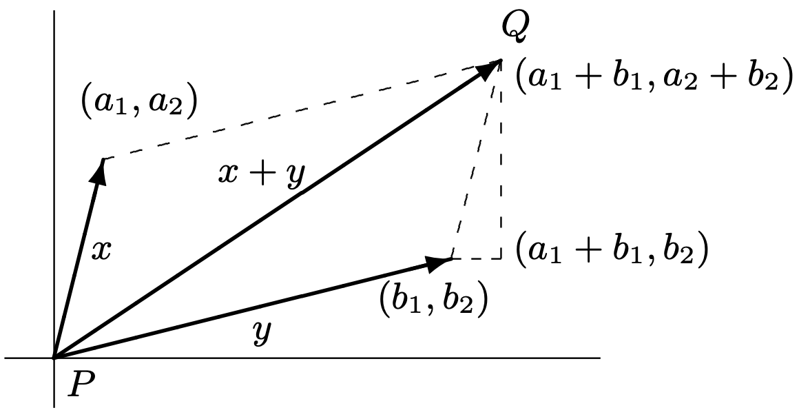
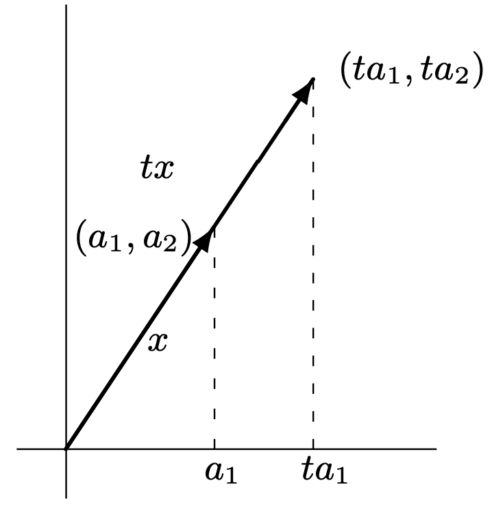
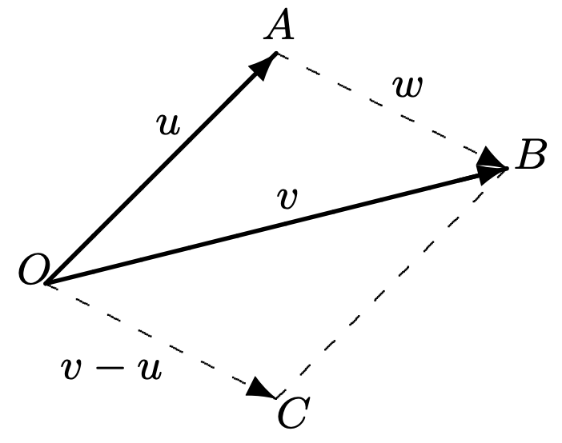
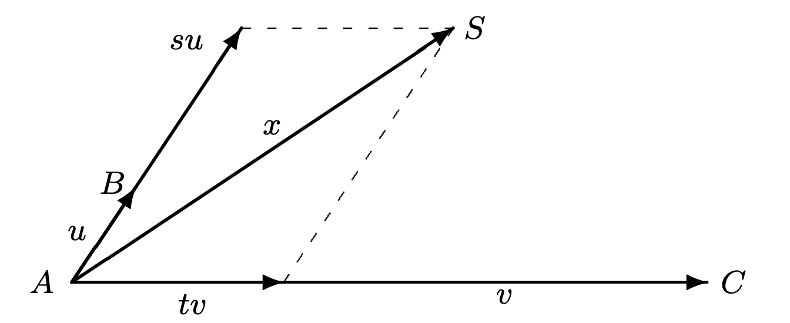

## Introduction

### 개념 정리

- Vector Addition
    + The sum of two vectors $x$ and $y$ that act at the same point $P$ is the vector beginning at $P$ that is represented by the diagonal of parallelogram having $x$ and $y$ as adjacent sides.
    + Let $(a_1, a_2)$ denote the endpoint of $x$ and $(b_1, b_2)$ denote the endpoint of $y$. Then as given figure shows, the endpoint $Q$ of $x + y$ is $(a_1 + b_1, a_2 + b_2)$.

    {:height="40%" width="40%"}

- Scalar Multiplication
    + If the vector $x$ is represented by an arrow, then for any real number $t$, the vector $tx$ is represented by an arrow in the same direction if $t \ge 0$ and in the opposite direction if $t \lt 0$. The length of the arrow $tx$ is $\lvert t \rvert$ times the length of the arrow $x$.
    + If the endpoint of $x$ has coordinates $(a_1, a_2)$, then the coordinates of the endpoint of $tx$ are easily seen to be $(ta_1, ta_2)$.

    {:height="25%" width="25%"}

- Parallel vector
    + Two nonzero vectors $x$ and $y$ are called parallel if $y = tx$ for some nonzero real number $t$. (Thus nonzero vectors having the same or opposite directions are parallel.)

- Properties for Vector Addition and Scalar Multiplication in Plane or Space
    + For all vectors $x$ and $y$, $x + y = y + x$.
    + For all vectors $x$, $y$, and $z$, $(x + y) + z = x + (y + z)$.
    + There exists a vector denoted $0$ such that $x + 0 = x$ for each vector $x$.
    + For each vector $x$, there is a vector $y$ such that $x + y = 0$.
    + For each vector $x$, $1x = x$.
    + For each pair of real numbers $a$ and $b$ and each vector $x$, $(ab)x = a(bx)$.
    + For each real number $a$ and each pair of vectors $x$ and $y$, $a(x + y) = ax + ay$.
    + For each pair of real numbers $a$ and $b$ and each vector $x$, $(a + b)x = ax + bx$.

- Equation of a Line in Space
    + Let $O$ denote the origin of a coordinate system in space, and let $u$ and $v$ denote the vectors that begin at $O$ and end at $A$ and $B$, respectively. Since a scalar multiple of $w$ is parallel to $w$ but possibly of a different length than $w$, any point on the line joining $A$ and $B$ may be obtained as the endpoint of a vector that begins at $A$ and has the form $tw$ for some real number $t$. Conversely, the endpoint of every vector of the form $tw$ that begins at $A$ lies on the line joining $A$ and $B$. Thus an equation of the line through $A$ and $B$ is 
    
    $$x = u + tw = u + t(v − u),$$
    
    where $t$ is a real number and $x$ denotes an arbitrary point on the line.

    {:height="25%" width="25%"}

- Equation of a Plane in Space
    + Let $u$ and $v$ denote vectors beginning at $A$ and ending at $B$ and $C$, respectively. Observe that any point in the plane containing $A$, $B$, and $C$ is the endpoint $S$ of a vector $x$ beginning at $A$ and having the form $su + tv$ for some real numbers $s$ and $t$. The endpoint of $su$ is the point of intersection of the line through $A$ and $B$ with the line through $S$ parallel to the line through $A$ and $C$. A similar procedure locates the endpoint of $tv$. Moreover, for any real numbers $s$ and $t$, the vector $su + tv$ lies in the plane containing $A$, $B$, and $C$. It follows that an equation of the plane containing $A$, $B$, and $C$ is

    $$x = A + su + tv,$$

    where $s$ and $t$ are arbitrary real numbers and $x$ denotes an arbitrary point in the plane.

    {:height="40%" width="40%"}

### 예제

> #### Example 1. Let $A$ and $B$ be points having coordinates $(−2, 0, 1)$ and $(4, 5, 3)$, respectively. The endpoint $C$ of the vector emanating from the origin and having the same direction as the vector beginning at $A$ and terminating at $B$ has coordinates $(4, 5, 3) − (−2, 0, 1) = (6, 5, 2)$. Hence the equation of the line through $A$ and $B$ is
>
> $$x = (−2, 0, 1) + t(6, 5, 2).$$

> #### Example 2. Let $A$, $B$, and $C$ be the points having coordinates $(1, 0, 2)$, $(−3, −2, 4)$, and $(1, 8, −5)$, respectively. The endpoint of the vector emanating from the origin and having the same length and direction as the vector beginning at $A$ and terminating at $B$ is
>
> $$(−3, −2, 4) − (1, 0, 2) = (−4, −2, 2).$$
>
> #### Similarly, the endpoint of a vector emanating from the origin and having the same length and direction as the vector beginning at $A$ and terminating at $C$ is $(1, 8, −5) − (1, 0, 2) = (0, 8, −7)$. Hence the equation of the plane containing the three given points is
>
> $$x = (1, 0, 2) + s(−4, −2, 2) + t(0, 8, −7).$$

### 연습 문제

> #### Problem 1. Determine whether the vectors emanating from the origin and terminating at the following pairs of points are parallel.
>
> #### (a) $(3, 1, 2)$ and $(6, 4, 2)$
>
> #### (b) $(−3, 1, 7)$ and $(9, −3, −21)$
>
> #### (c) $(5, −6, 7)$ and $(−5, 6, −7)$
>
> #### (d) $(2, 0, −5)$ and $(5, 0, −2)$
>
> (a) $(3, 1, 2) = t(6, 4, 2)$을 만들 수 있는 실수 $t$가 존재하지 않으므로 두 벡터는 평행하지 않는다.
>
> (b) $(-3, 1, 7) = t(9, -3, -21)$을 만들 수 있는 실수 $t$는 $t = -3$이다. 따라서, 두 벡터는 평행한다.
>
> (c) $(5, -6, 7) = t(-5, 6, -7)$을 만들 수 있는 실수 $t$는 $t = -1$이다. 따라서, 두 벡터는 평행한다.
>
> (d) $(2, 0, -5) = (5, 0, -2)$을 만들 수 있는 실수 $t$가 존재하지 않으므로 두 벡터는 평행하지 않는다.

> #### Problem 2. Find the equations of the lines through the following pairs of points in space.
>
> #### (a) $(3, −2, 4)$ and $(−5, 7, 1)$
>
> #### (b) $(2, 4, 0)$ and $(−3, −6, 0)$
>
> #### (c) $(3, 7, 2)$ and $(3, 7, −8)$
>
> #### (d) $(−2, −1, 5)$ and $(3, 9, 7)$
>
> (a) 점 $A$와 $B$를 $A(3, −2, 4)$, $B(−5, 7, 1)$로 잡자. 그러면 $u = (3, -2, 4)$, $v = (-5, 7, 1)$이고, $w = v - u = (-5, 7, 1) - (3, -2, 4) = (-8, 9, -3)$이다. 이를 직선의 방정식 공식에 대입하면
>
> $$x = u + wt = (3, -2, 4) + t(-5, 7, 1)$$
>
> 이 점 $A$와 $B$를 잇는 직선의 방정식이 된다. (단, $t$는 임의의 실수이다.)
>
> (b) 점 $A$와 $B$를 $A(2, 4, 0)$, $B(−3, −6, 0)$로 잡자. 그러면 $u = (2, 4, 0)$, $v = (−3, −6, 0)$이고, $w = v - u = (−3, −6, 0) - (2, 4, 0) = (-5, -10, 0)$이다. 이를 직선의 방정식 공식에 대입하면
>
> $$x = u + wt = (2, 4, 0) + t(-5, -10, 0)$$
>
> 이 점 $A$와 $B$를 잇는 직선의 방정식이 된다. (단, $t$는 임의의 실수이다.)
>
> (c) 점 $A$와 $B$를 $A(3, 7, 2)$, $B(3, 7, −8)$로 잡자. 그러면 $u = (3, 7, 2)$, $v = (3, 7, −8)$이고, $w = v - u = (3, 7, −8) - (3, 7, 2) = (0, 0, -10)$이다. 이를 직선의 방정식 공식에 대입하면
>
> $$x = u + wt = (3, 7, 2) + t(0, 0, -10)$$
>
> 이 점 $A$와 $B$를 잇는 직선의 방정식이 된다. (단, $t$는 임의의 실수이다.)
>
> (d) 점 $A$와 $B$를 $A(−2, −1, 5)$, $B(3, 9, 7)$로 잡자. 그러면 $u = (−2, −1, 5)$, $v = (3, 9, 7)$이고 $w = v - u = (3, 9, 7) - (−2, −1, 5) = (5, 10, -2)$이다. 이를 직선의 방정식 공식에 대입하면
>
> $$x = u + wt = (−2, −1, 5) + t(5, 10, -2)$$
>
> 이 점 $A$와 $B$를 잇는 직선의 방정식이 된다. (단, $t$는 임의의 실수이다.)

> #### Problem 3. Find the equations of the planes containing the following points in space.
>
> #### (a) $(2, −5, −1)$, $(0, 4, 6)$, and $(−3, 7, 1)$
>
> #### (b) $(3, −6, 7)$, $(−2, 0, −4)$, and $(5, −9, −2)$
>
> #### (c) $(−8, 2, 0)$, $(1, 3, 0)$, and $(6, −5, 0)$
>
> #### (d) $(1, 1, 1)$, $(5, 5, 5)$, and $(−6, 4, 2)$
>
> (a) 점 $A$, $B$, $C$를 $A(2, −5, −1)$, $B(0, 4, 6)$, $C(−3, 7, 1)$로 잡자. 그러면 $u = (0, 4, 6) - (2, -5, -1) = (-2, 9, 7)$, $v = (-3, 7, 1) - (2, -5, -1) = (-5, 12, 2)$가 된다. 이를 평면의 방정식 공식에 대입하면
>
> $$x = (2, -5, -1) + s(-2, 9, 7) + t(-5, 12, 2)$$
>
> 이 점 $A$, $B$, $C$를 지나는 평면의 방정식이 된다. (단, $s$, $t$는 임의의 실수이다.)
>
> (b) 점 $A$, $B$, $C$를 $A(3, −6, 7)$, $B(−2, 0, −4)$, $C(5, −9, −2)$로 잡자. 그러면 $u = (-2, 0, -4) - (3, -6, 7) = (-5, 6, -11)$, $v = (5, −9, −2) - (3, −6, 7) = (2, -3, -9)$가 된다. 이를 평면의 방정식 공식에 대입하면
>
> $$x = (3, −6, 7) + s(-5, 6, -11) + t(2, -3, -9)$$
>
> 이 점 $A$, $B$, $C$를 지나는 평면의 방정식이 된다. (단, $s$, $t$는 임의의 실수이다.)
>
> (c) 점 $A$, $B$, $C$를 $A(−8, 2, 0)$, $B(1, 3, 0)$, $C(6, −5, 0)$로 잡자. 그러면 $u = (1, 3, 0) - (−8, 2, 0) = (9, 1, 0)$, $v = (6, −5, 0) - (−8, 2, 0) = (14, -7, 0)$가 된다. 이를 평면의 방정식 공식에 대입하면
>
> $$x = (−8, 2, 0) + s(9, 1, 0) + t(14, -7, 0)$$
>
> 이 점 $A$, $B$, $C$를 지나는 평면의 방정식이 된다. (단, $s$, $t$는 임의의 실수이다.)
>
> (d) 점 $A$, $B$, $C$를 $A(1, 1, 1)$, $B(5, 5, 5)$, $C(−6, 4, 2)$로 잡자. 그러면 $u = (5, 5, 5) - (1, 1, 1) = (4, 4, 4)$, $v = (−6, 4, 2) - (1, 1, 1) = (-7, 3, 1)$가 된다. 이를 평면의 방정식 공식에 대입하면
>
> $$x = (1, 1, 1) + s(4, 4, 4) + t(-7, 3, 1)$$
>
> 이 점 $A$, $B$, $C$를 지나는 평면의 방정식이 된다. (단, $s$, $t$는 임의의 실수이다.)

> #### Problem 4. What are the coordinates of the vector $0$ in the Euclidean plane that satisfies property "There exists a vector denoted $0$ such that $x + 0 = x$ for each vector $x$."? Justify your answer.
>
> 벡터 $x$를 $x = (a, b)$라 하자. 또, 벡터 $0$을 $0 = (c, d)$라 하자. 그러면 
>
> $$x + 0 = (a, b) + (c, d) = (a + c, b + d) = (a, b) = x$$
>
> 여야 한다. $a + c = a$인 $c$는 $0$ 밖에 없고, 마찬가지로 $b + d = b$인 $d$는 $0$ 밖에 없다. 
>
> 따라서, 벡터 $0$은 $0 = (0, 0)$이어야 한다.

> #### Problem 5. Prove that if the vector $x$ emanates from the origin of the Euclidean plane and terminates at the point with coordinates $(a_1, a_2)$, then the vector $tx$ that emanates from the origin terminates at the point with coordinates $(ta_1, ta_2)$.

> #### Problem 6. Show that the midpoint of the line segment joining the points $(a, b)$ and $(c, d)$ is $\left(\frac{a + c}{2}, \frac{b + d}{2}\right)$.

> #### Problem 7. Prove that the diagonals of a parallelogram bisect each other.