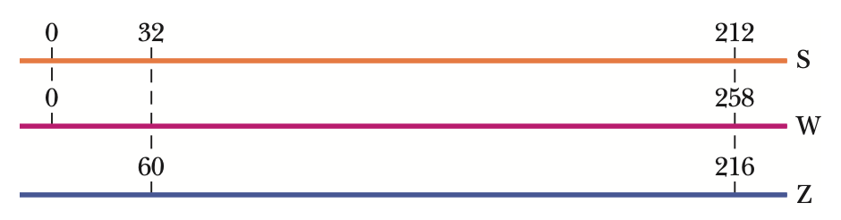

## Measuring Things, Including Lengths

### 개념 요약

- SI 단위계
    + | __물리량__ | __이름__ | __기호__ |
      | 길이 | 미터 | $\text{m}$ |
      | 질량 | 킬로그램 | $\text{kg}$|
      | 시간 | 초 | $\text{s}$ |
      | 전류 | 암페어 | $\text{A}$ |
      | 온도 | 켈빈 | $\text{K}$  |
      | 물질량 | 몰 | $\text{mol}$|
      | 광도 | 칸델라 | $\text{cd}$ |

- SI 접두어
    + | __$10^n$__ | __접두어__ | __기호__ |
      | $10^{24}$ | 요타 (yotta-) | $\text{Y}$ |
      | $10^{21}$ | 제타 (zetta-) | $\text{Z}$ |
      | $10^{18}$ | 엑사 (exa-) | $\text{E}$ |
      | $10^{15}$ | 페타 (peta-) | $\text{P}$ |
      | $10^{12}$ | 테라 (tera-) | $\text{T}$ |
      | $10^9$ | 기가 (giga-) | $\text{G}$ |
      | $10^6$ | 메가 (mega-) | $\text{M}$ |
      | $10^3$ | 킬로 (kilo-) |	$\text{k}$ |
      | $10^2$ | 헥토 (hecto-) | $\text{h}$ |
      | $10^1$ | 데카 (deca-) | $\text{da}$ |
      | $10^0$ | 
-
 | 
-
 |
      | $10^{−1}$ | 데시 (deci-) | $\text{d}$ |
      | $10^{−2}$ | 센티 (centi-) | $\text{c}$ |
      | $10^{−3}$ | 밀리 (milli-) | $\text{m}$ |
      | $10^{−6}$ | 마이크로 (micro-) | $\text{µ}$ |
      | $10^{−9}$ |	나노 (nano-) | $\text{n}$ |
      | $10^{−12}$ | 피코 (pico-) | $\text{p}$ |
      | $10^{−15}$ | 펨토 (femto-) | $\text{f}$ |
      | $10^{−18}$ | 아토 (atto-) |	$\text{a}$ |
      | $10^{−21}$ | 젭토 (zepto-) | $\text{z}$ |
      | $10^{−24}$ | 욕토 (yocto-) | $\text{y}$ |

- 단위 변환
    + $\frac{1 \text{ min}}{60 \text{ s}}$와 같이 $1$이 되도록 만든 단위 환산 인자를 통해서 환산할 수 있다.
    + (예시) $108 \text{ km/h} = \frac{108 \times \frac{1 \text{km}}{1 000 \text{m}} \times 1 000 \text{ m}}{1 \times \frac{1 \text{ h}}{3 600 \text{ s}} \times 3 600 \text{ s}} = \frac{108000 \text{ m}}{3600 \text{ s}} = 30 \text{ m/s}$
        

- 차원 분석
    + 기본 차원으로는 길이 $\text{L}$, 질량 $\text{M}$, 시간 $\text{T}$, 온도 $\Theta$, 전류 $\text{I}$, 물질의 양 $\text{N}$, 광도 $\text{J}$이 있다. 이를 통하여 속도의 단위인 $\text{km}/\text{h}$나 힘의 단위인 $\text{N}$과 같이 기본 단위를 통해 유도한 단위들의 차원을 분석할 수 있다.
    + (예시) 속도의 경우는 다음과 같이 차원 분석할 수 있다.

        $$[v] = \frac{\text{L}}{\text{T}}$$

- 유효 숫자란 계산의 정확도에 영향을 미칠 수 있는 숫자들이다. $0$이 아닌 모든 숫자는 유효 숫자라고 할 수 있다. 다만, $0$의 경우에는 조금 다르다. $0$이 다른 숫자들 사이에 끼어있을 때는 유효 숫자 취급을 한다. 하지만, $0.004$와 같이 자릿수를 맞추기 위한 경우에는 유효 숫자 취급을 하지 않는다. 그리고 $3400$과 같이 정수에서 오른쪽에 붙어있는 $0$들은 유효 숫자 취급을 정확히 할 수 없다. (예시의 경우에는 유효 숫자가 2개인지, 3개인지, 4개인지 정확히 식별할 수 없기 때문이다.) 마지막으로, $120.00$과 같이 소수점 오른쪽에 붙어있는 $0$들은 유효 숫자 취급을 한다.

 덧셈과 뺄셈을 하고 나면 소수점 아래에 더 적은 유효 숫자를 가진 쪽에 소수점 이하 유효 숫자 개수를 맞춘다.
    + (예시) $3.14 + 9.111 = 12.25$
    
 곱셈과 나눗셈을 한 뒤에는 더 적은 유효 숫자를 가진 쪽에 유효 숫자 개수를 맞춘다.
    + (예시) $3.14 \times 3.1415 = 9.86$

- 다음은 길이의 정의이다.
    > 진공 속에서 빛이 $\frac{1}{299792458} \text{ s}$ 간 이동한 거리를 $1 \text{ m}$로 한다.

### 예제

### 연습 문제

> #### 1. Earth is approximately a sphere of radius $6.37 \times 10^6 \text{ m}$. What are (a) its circumference in kilometers, (b) its surface area in square kilometers, and (c) its volume in cubic kilometers?
>
> (a) 구의 둘레는 $2\pi r$이므로 $r = 6.37 \times 10^6 \text{ m}$을 대입하자. 그러면
>
> $$2 \pi \times 6.37 \times 10^6 \text{ m} = 40.0 \times 10^6 \text{ m}$$
>
> 이므로 지구의 둘레는 $40.0 \times 10^3 \text{ km}$이다.
>
> (b) 구의 겉넓의는 $4\pi r^2$이므로 $r = 6.37 \times 10^6 \text{ m}$을 대입하면
>
> $$4 \pi \times (6.37 \times 10^6 \text{ m})^2 = 5.10 \times 10^{14} \text{ m}^2$$
>
> 이므로 지구의 겉넓이는 $5.10 \times 10^{8} \text{ km}^2$이다.
>
> (c) 구의 부피는 $\frac{4}{3} \pi r^3$이므로 $r = 6.37 \times 10^6 \text{ m}$을 대입하면
>
> $$\frac{4}{3} \pi \times (6.37 \times 10^6 \text{ m})^3 = 1.08 \times 10^{21} \text{ m}^3$$
>
> 이므로 지구의 부피는 $1.08 \times 10^{12} \text{ m}^3$이다.

> #### 2. A $\text{gry}$ is an old English measure for length, defined as $\frac{1}{10}$ of a $\text{line}$, where $\text{line}$ is another old English measure for length, defined as $\frac{1}{12}$ $\text{inch}$. A common measure for length in the publishing business is a $\text{point}$, defined as $\frac{1}{72}$ $\text{inch}$. What is an area of $0.50 \text{ gry}^2$ in points squared ($\text{points}^2$)?
>
> $1 \text{ gry} = \frac{1}{120} \text{ inch}$이고 $1 \text{ point} = \frac{1}{72} \text{ inch}$이므로 $1 \text{ gry} = \frac{72}{120} \text{ points} = \frac{3}{5} \text{ points}$이다. 따라서,
>
> $$0.50 \text{ gry}^2 = 0.50 \times \left( \frac{3}{5} \text{ points}\right)^2 = 0.18 \text{ points}^2$$
>
> 이다.

> #### 3. The micrometer ($1 \text{ }\mu\text{m}$) is often called the $\text{micron}$. (a) How many $\text{microns}$ make up $1.0 \text{ km}$? (b) What fraction of a centimeter equals $1.0 \text{ }\mu\text{m}$? (c) How many microns are in $1.0 \text{ yd}$?
>
> (a) $1 \text{ }\mu\text{m} = 10^{-6} \text{ m}$이고 $1.0 \text{ km} = 1.0 \times 10^3 \text{ m}$이므로 $1.0 \text{ km} = 1.0 \times 10^3 \times 10^6 \text{ }\mu\text{m} = 1.0 \times 10^9 \text{ }\mu\text{m}$이다. 따라서, $\text{micron}$이 $10^9$개 있어야 $1.0 \text{ km}$이 된다.
>
> (b) $1 \text{ cm} = 10^{-2} \text{ m} = 10^4 \text{ }\mu\text{m}$이므로 $\text{micron}$이 $10^4$개 있어야 $1 \text{ cm}$이 된다.
>
> (c) $1 \text{ }\mu\text{m} = 10^{-6} \text{ m}$이므로 $1.0 \text{ yd} = 0.91 \text{ m} = 0.91 \times 10^6 \text{ }\mu\text{m} = 9.1 \times 10^5 \text{ }\mu\text{m}$이다. 따라서, $\text{micron}$이 $9.1 \times 10^5$개 있어야 $1.0 \text{ yd}$이 된다.

> #### 4. Spacing in this book was generally done in units of points and picas: $12 \text{ points} = 1 \text{ pica}$, and $6 \text{ picas} = 1 \text{ inch}$. If a figure was misplaced in the page proofs by $0.80 \text{ cm}$, what was the misplacement in (a) picas and (b) points?
>
> (a) $0.80 \text{ cm} = 0.31 \text{ inch} = 0.31 \times 6 \text{ picas} = 1.9 \text{ picas}$ 이다.
>
> (b) $0.80 \text{ cm} = 0.31 \text{ inch} = 1.9 \text{ picas} = 1.9 \times 12 \text{ points} = 23 \text{ points}$ 이다.

> #### 5. Horses are to race over a certain English meadow for a distance of $4.0 \text{ furlongs}$. What is the race distance in (a) $\text{rods}$ and (b) $\text{chains}$? ($1 \text{ furlong} = 201.168 \text{ m}$, $1 \text{ rod} = 5.0292 \text{ m}$, and $1 \text{ chain} = 20.117 \text{ m}$.)
>
> (a) $4.0 \text{ furlongs} = 4.0 \times \frac{201.168}{5.0292} \text{ m} = 160 \text{ m}$ 이다.
>
> (b) $4.0 \text{ furlongs} = 4.0 \times \frac{201.168}{20.117} \text{ m} = 40 \text{ m}$ 이다.

> #### 6. You can easily convert common units and measures electronically, but you still should be able to use a conversion table, such as those in Appendix D. Following table is part of a conversion table for a system of volume measures once common in Spain; a volume of $1 \text{ fanega}$ is equivalent to $55.501 \text{ dm}^3$ (cubic decimeters). To complete the table, what numbers (to three significant figures) should be entered in (a) the $\text{cahiz}$ column, (b) the $\text{fanega}$ column, (c) the $\text{cuartilla}$ column, and (d) the $\text{almude}$ column, starting with the top blank? Express $7.00 \text{ almudes}$ in (e) $\text{medios}$, (f) $\text{cahizes}$, and (g) cubic centimeters ($\text{cm}^3$).
>
> (a), (b), (c), (d)
>
> | | $\text{cahiz}$ | $\text{fanega}$ | $\text{cuartilla}$ | $\text{almude}$ | $\text{medios}$|
> | $1 \text{ cahiz}$ | $1$ | $12$ | $48$ | $144$ | $288$ |
> | $1 \text{ fanega}$ | $8.33 \times 10^{-2}$ | $1$ | $4$ | $12$ | $24$ |
> | $1 \text{ cuartilla}$ | $2.08 \times 10^{-2}$ | $0.250$ | $1$ | $3$ | $6$ |
> | $1 \text{ almude}$ | $6.94 \times 10^{-3}$ | $8.33 \times 10^{-2}$ | $0.333$ | $1$ | $2$ |
> | $1 \text{ medio}$ | $3.47 \times 10^{-3}$ | $4.17 \times 10^{-2}$ | $0.167$ | $0.500$ | $1$ |
>
> (e) $7.00 \text{ almudes} = 7.00 \times 2 \text{ medios} = 14.0 \text{ medios}$ 이다.
>
> (f) $7.00 \text{ almudes} = 7.00 \times 6.94 \times 10^{-3} \text{ cahizes} = 4.86 \times 10^{-2} \text{ cahizes}$ 이다.
>
> (g) $7.00 \text{ almudes} = 7.00 \times 8.33 \times 10^{-2} \times 55.501 \text{ dm}^3 = 32.4 \text{ dm}^3 = 32.4 \times 10^3 \text{ cm}^3$ 이다.

> #### 7. Hydraulic engineers in the United States often use, as a unit of volume of water, the acre-foot, defined as the volume of water that will cover $1 \text{ acre}$ of land to a depth of $1 \text{ ft}$. A severe thunderstorm dumped $2.0 \text{ in}$. of rain in $30 \text{ min}$ on a town of area $26 \text{ km}^2$. What volume of water, in acre-feet, fell on the town?
>
> 부피를 $V$라 하면
>
> $$V = 2.0 \text{ in} \times 26 \text{ km}^2 = 2.0 \times \frac{1}{12} \text{ ft} \times 26 \times 6400 \text{ acre} = 28 \times 10^3 \text{ acre-feet}$$
>
> 이다.

> #### 8. Harvard Bridge, which connects MIT with its fraternities across the Charles River, has a length of $364.4 \text{ Smoots}$ plus one ear. The unit of one $\text{Smoot}$ is based on the length of Oliver Reed Smoot, Jr., class of 1962, who was carried or dragged length by length across the bridge so that other pledge members of the Lambda Chi Alpha fraternity could mark off (with paint) $1-\text{Smoot}$ lengths along the bridge. The marks have been repainted biannually by fraternity pledges since the initial measurement, usually during times of traffic congestion so that the police cannot easily interfere. (Presumably, the police were originally upset because the $\text{Smoot}$ is not an SI base unit, but these days they seem to have accepted the unit.) Following figure shows three parallel paths, measured in $\text{Smoots}$(S), $\text{Willies}$(W), and $\text{Zeldas}$(Z). What is the length of $50.0 \text{ Smoots}$ in (a) $\text{Willies}$ and (b) $\text{Zeldas}$?
>
> {:height="40%" width="40%"}
>
> (a) $212 \text{ Smoots} = 258 \text{ Willies}$이므로 $1 \text{ Smoots} = 1.22 \text{ Willies}$이고 따라서 $50.0 \text{ Smoots} = 60.8 \text{ Willies}$이다.
>
> (b) $180 \text{ Smoots} = 156 \text{ Zeldas}$이므로 $1 \text{ Smoots} = 0.867 \text{ Zeldas}$이고 따라서 $50.0 \text{ Smoots} = 43.3 \text{ Zeldas}$이다.

> #### 9. Antarctica is roughly semicircular, with a radius of 2000 km (see the figure below). The average thickness of its ice cover is 3000 m. How many cubic centimeters of ice does Antarctica contain? (Ignore the curvature of Earth.)
>
> 남극의 부피를 $V$라 하자. 그러면 
>
> $$V = \pi \times (2000 \text{ km})^2 \times \frac{1}{2} \times 3000 \text{ km} = 18.85 \times 10^{10} \text{ km}^3$$인데 $1 \text{ km} = 1000 \times 100 \text{ cm} = 10^5 \text{ cm} \Rightarrow 1 \text{ km}^3 = 10^{15} \text{ cm}^3$이므로 $V = 18.85 \times 10^{10} \times 10^{15} \text{ cm}^3 = 18.85 \times 10^{25} \text{ cm}^3$이다.
