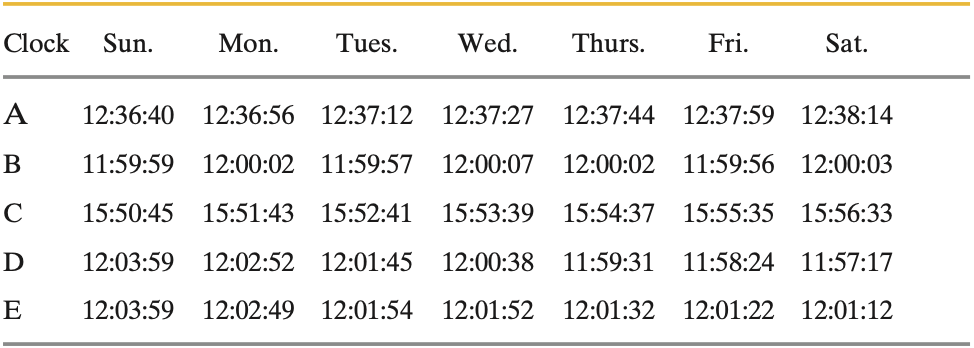
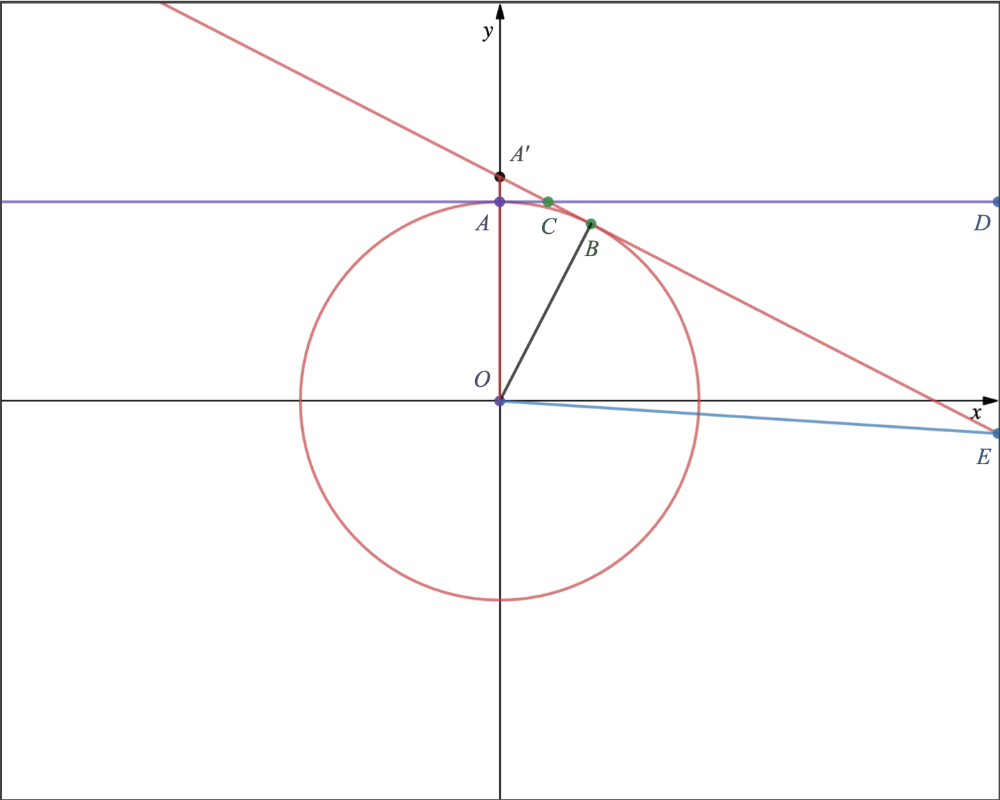

## Time

### 개념 요약

- The second is defined in terms of the oscillations of light emitted by an atomic (cesium-133) source. Accurate time signals are sent worldwide by radio signals keyed to atomic clocks in standardizing laboratories.

### 예제

### 연습 문제

> #### 1. Until 1883, every city and town in the United States kept its own local time. Today, travelers reset their watches only when the time change equals $1.0 \text{ h}$. How far, on the average, must you travel in degrees of longitude between the time-zone boundaries at which your watch must be reset by $1.0 \text{ h}$? (Hint: Earth rotates $360^{\circ}$ in about $24 \text{ h}$.)
>
> $360^{\circ}$를 $24 \text{ h}$만에 돌기 때문에 한 시간 당 $15^{\circ}$씩 돌 것이다. 따라서, 타임 존 사이의 각도는 $15^{\circ}$이다.

> #### 2. For about $10$ years after the French Revolution, the French government attempted to base measures of time on multiples of ten: One week consisted of $10$ days, one day consisted of $10$ hours, one hour consisted of $100$ minutes, and one minute consisted of $100$ seconds. What are the ratios of (a) the French decimal week to the standard week and (b) the French decimal second to the standard second?
>
> (a) 두 시스템 간의 $1$주의 비는 $\frac{10 \text{ days}}{7 \text{ days}} = \frac{10}{7}$이다.
>
> (b) 두 시스템 간의 $1$초의 비는 $\frac{\frac{1}{100} \text{ min}}{\frac{1}{60} \text{ min}} = \frac{60}{100} = \frac{3}{5}$이다.

> #### 3. The fastest growing plant on record is a *Hesperoyucca whipplei* that grew $3.7 \text{ m}$ in $14 \text{ days}$. What was its growth rate in micrometers per second?
>
> $14$일 간 성장한 길이를 $14$일로 나누면 된다. 답은 $\frac{3.7 \times 10^6 \text{ }\mu\text{m}}{14 \times 24 \times 60 \times 60 \text{ s}} = 3.1 \text{ }\mu\text{m}/\text{s}$이다.

> #### 4. Three digital clocks $A$, $B$, and $C$ run at different rates and do not have simultaneous readings of zero. Following figure shows simultaneous readings on pairs of the clocks for four occasions. (At the earliest occasion, for example, $B$ reads $25.0 \text{ s}$ and $C$ reads $92.0 \text{ s}$.) If two events are $600 \text{ s}$ apart on clock $A$, how far apart are they on (a) clock $B$ and (b) clock $C$? (c) When clock $A$ reads $400 \text{ s}$, what does clock $B$ read? (d) When clock $C$ reads $15.0 \text{ s}$, what does clock $B$ read? (Assume negative readings for prezero times.)
>
> (a) $A$에서 $200 \text{ s}$가 지나는 동안 $B$에서는 $165 \text{ s}$가 흘렀으므로, $A$에서의 $600 \text{ s}$는 $B$에선 $600 \times \frac{165}{200} \text{ s} = 495 \text{ s}$가 된다.
>
> (b) $B$에서 $175.0 \text{ s}$가 지나는 동안 $C$에서는 $50.0 \text{ s}$가 흘렀으므로, $A$에서의 $600 \text{ s}$를 $B$에서의 $495 \text{ s}$로 보고 풀면 $C$에서는 $495 \times \frac{50.0}{175.0} \text{ s} = 141 \text{ s}$가 된다.
>
> (c) $A$에서 $400 \text{ s}$일 때 $B$는 몇 초일지 알기 위해서는 (a)에서 구한 $A$와 $B$의 시간 비를 잘 이용하면 된다. $A$에서 $312 \text{ s}$일 때 $B$는 $125 \text{ s}$였고, $A$에서 $88 \text{ s}$가 흐른 사이 $B$는 얼마나 흘렀느냐가 관건이 될 것이다. 따라서 식은 다음과 같다.
>
> $$125 \text{ s} + 88 \text{ s} \times \frac{165 \text{ s}}{200 \text{ s}} = 197.6 \text{ s}$$
>
> 그러므로 $A$에서 $400 \text{ s}$일 때 $B$에서는 $197.6 \text{ s}$이다.
>
> (d) (c)에서 푼 방법 그대로 적용하면
>
> $$25.0 \text{ s} + (-77.0) \text{ s} \times \frac{175.0 \text{ s}}{50.0 \text{ s}} = -244.5 \text{ s}$$
>
> 이다. 그러므로 $C$에서는 $0 \text{ s}$가 표시 되기 $244.5 \text{ s}$ 전이다.

> #### 5. A lecture period ($50 \text{ min}$) is close to $1$ microcentury. (a) How long is a microcentury in minutes? (b) Using
>
> $$\text{percentage difference} = \left(\frac{\text{actual} - \text{approximation}}{\text{actual}}\right) 100,$$
>
> #### find the percentage difference from the approximation.
>
> (a) $1 \text{ microcentury} = 10^{-6} \text{ century} = 10^{-6} \times 10^2 \text{ yr} = 10^{-4} \times 365 \text{ days} = 10^{-4} \times 365 \times 24 \times 60 \text{ min} = 52.56 \text{ min}$ 이다.
>
> (b) 주어진 식을 이용하면
>
> $$\frac{(52.56 - 50) \text{ min}}{52.56 \text{ min}} \times 100 \% = 4.871 \%$$
>
> 이다.

> #### 6. A fortnight is a charming English measure of time equal to $2.0$ weeks (the word is a contraction of “fourteen nights”). That is a nice amount of time in pleasant company but perhaps a painful string of microseconds in unpleasant company. How many microseconds are in a fortnight?
>
> \begin{align\*} 2.0 \text{ weeks} &= 2.0 \times 7 \text{ days} = 2.0 \times 7 \times 24 \text{ hrs} = 2.0 \times 7 \times 24 \times 60 \times 60 \times 10^6 \text{ }\mu\text{s} \\\\ &= 1.2 \times 10^{12} \text{ }\mu\text{s} \end{align\*}
> 따라서, $2.0$주는 $1.2 \times 10^{12} \text{ }\mu\text{s}$이다.

> #### 7. Time standards are now based on atomic clocks. A promising second standard is based on pulsars, which are rotating neutron stars (highly compact stars consisting only of neutrons). Some rotate at a rate that is highly stable, sending out a radio beacon that sweeps briefly across Earth once with each rotation, like a lighthouse beacon. Pulsar PSR $1937 + 21$ is an example; it rotates once every $1.557 806 448 872 75 \pm 3 \text{ ms}$, where the trailing $\pm 3$ indicates the uncertainty in the last decimal place (it does not mean $\pm 3 \text{ ms}$). (a) How many rotations does PSR $1937 + 21$ make in $7.00 \text{ days}$? (b) How much time does the pulsar take to rotate exactly one million times and (c) what is the associated uncertainty?
>
> (a) \begin{align\*} 7.00 \text{ days} &= 7.00 \times 24 \text{ hrs} = 7.00 \times 24 \times 60 \times 60 \times 10^3 \text{ ms} \\\\ &= 6.05 \times 10^{8} \text{ ms}\end{align\*}
>
> 위의 식을 통해 $7$일을 마이크로초로 바꿀 수 있다. 이를 PSR $1937 + 21$의 회전주기로 나눠주면 몇번이나 회전했는지 알 수 있을 것이다. 이는
>
> $$6.05 \times 10^8 \text{ ms} \div 1.55780644887275 \text{ ms} = 3.88 \times 10^8$$
>
> 이므로 $3.88 \times 10^8$번 회전함을 알 수 있다.
>
> (b) $1.55780644887275 \text{ ms} \times 10^6 = 1.55780644887275 \times 10^6 \text{ ms}$ 이다.
>
> (c) $\pm 3 \times 10^{-14} \text{ ms} \times 10^6 = \pm 3 \times 10^{-8} \text{ ms} = \pm 3 \times 10^{-11} \text{ s}$이다.

> #### 8. Five clocks are being tested in a laboratory. Exactly at noon, as determined by the WWV time signal, on successive days of a week the clocks read as in the following table. Rank the five clocks according to their relative value as good timekeepers, best to worst. Justify your choice.
>
> {:height="40%" width="40%"}
>
> 나는 정오를 가리키는 시간의 차이를 하루 간격으로 재어 모두 더한 값이 가장 작은 값이 시간적 정확도가 높다고 생각한다. 지금은 비록 정오에 가까운 시간에 정오라고 나타내는 시계가 있을지 몰라도 시간이 매일매일 차이가 나게 되면 금방 정오와는 상관 없는 시간에 정오라고 할 수 있기 때문이다. 그러나, 정오가 아닌 때에 정오라고 하더라도 시간의 차이가 적은 시계는 그저 시계를 뒤로 돌려 정오에 맞춰주기만 하면 오랫동안 신뢰성을 가지고 작동하기에 시간적 정확도가 높다고 본다. 다음은 내가 생각하는 시간적 정확도를 구하기 위해 2일간의 시간의 차이를 더하는 식이다.
> 
> $A$ : $(0:16 + 0:16 + 0:15 + 0:17 + 0:15 + 0:15) \text{ s} = 1:34 \text{ s}$
> 
> $B$ : $(0:03 + 0:05 + 0:10 + 0:05 + 0:06 + 0:07) \text{ s} = 0:36 \text{ s}$
> 
> $C$ : $(0:58 + 0:58 + 0:58 + 0:58 + 0:58 + 0:58) \text{ s} = 5:48 \text{ s}$
> 
> $D$ : $(1:07 + 1:07 + 1:07 + 1:07 + 1:07 + 1:07) \text{ s} = 6:42 \text{ s}$
> 
> $E$ : $(1:10 + 0:55 + 0:02 + 0:20 + 0:10 + 0:10) \text{ s} = 2:47 \text{ s}$
>
> 따라서, 내가 생각하는 좋은 시계는 $B > A > E > C > D$ 순이다.

> #### 9. Because Earth’s rotation is gradually slowing, the length of each day increases: The day at the end of $1.0$ century is $1.0 \text{ ms}$ longer than the day at the start of the century. In $20$ centuries, what is the total of the daily increases in time?

> #### 10. Suppose that, while lying on a beach near the equator watching the Sun set over a calm ocean, you start a stopwatch just as the top of the Sun disappears. You then stand, elevating your eyes by a height $H = 1.70 \text{ m}$, and stop the watch when the top of the Sun again disappears. If the elapsed time is $t = 11.1 \text{ s}$, what is the radius $r$ of Earth?
>
> {:height="30%" width="30%"}
>
> 위는 문제에 주어진 상황을 간략하게 한 그래프이다.($A$ : 누워있을 때의 시점, $A'$ : 일어섰을 때의 시점, $D$ : 누워있을 때 해가 지는 위치, $E$ : 일어섰을 때 해가 지는 위치) 그래프를 보면, $\angle DCE = \theta$라 할 때 $\theta = \angle ACA' = \angle AOB$이다. 여기서, $\cos \theta = \frac{r}{r + H}$인데 $\frac{\theta}{360^{\circ}} = \frac{t}{24 \text{ h}}$이므로 이를 통해 $\theta$를 알아내고 $r$도 알아낼 수 있다.
>
> $$\theta = 360^{\circ} \times \frac{11.1 \text{ s}}{24 \times 60 \times 60 \text { s}} = 46.3 \times {10^{-3}}^{\circ}$$
>
> 이므로 $\cos \theta = \frac{r}{r + H} \Rightarrow r = \frac{H \cos \theta}{1 - \cos \theta} = 5.22 \times 10^6 \text{ m}$임을 알 수 있다. 따라서, 지구의 반지름 $r$은 $5.22 \times 10^6 \text{ m}$임을 알 수 있다.
 
<!--
- 시간
    + 절대영도 상태의 세슘 원자의 바닥 상태의 두 전자 준위 사이의 전이에 해당하는 복사선이 가지는 주기의 $9192631770$회 지속 시간을 $1 \text{ s}$로 정한다.
-->