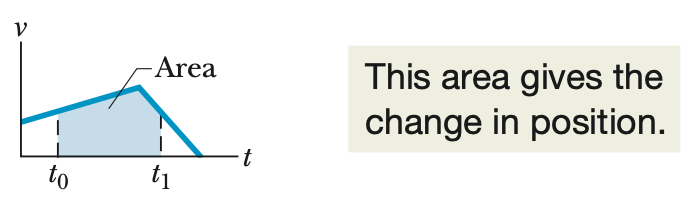
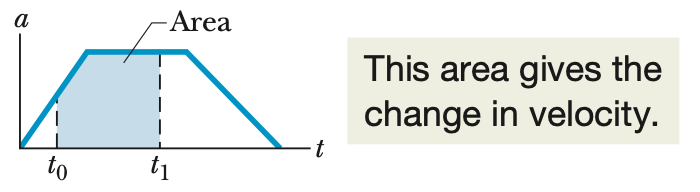

## Graphical Integration In Motion Analysis

### 개념 요약

- On a graph of acceleration $a$ versus time $t$, the change in the velocity is given by

$$v_1 - v_0 = \int^{t_1}_{t_0} a \, dt.$$

The integral amounts to finding an area on the graph:

$$\int^{t_1}_{t_0} a \, dt = (\text{area between acceleration curve and time axis, from } t_0 \text{ to } t_1).$$

-  On a graph of velocity $v$ versus time $t$, the change in the position is given by

$$x_1 - x_0 = \int^{t_1}_{t_0} v \, dt.$$

where the integral can be taken from the graph as

$$\int^{t_1}_{t_0} v \, dt = (\text{area between velocity curve and time axis, from } t_0 \text{ to } t_1).$$

<!--
- 그래프를 통한 운동의 이해
    + 시간에 대한 속도의 그래프를 적분하면 위치의 변화량을 알 수 있다.
        {:height="30%" width="30%"}
        + (증명) 속도의 정의에 따르면

            $$v = \frac{dx}{dt}$$

            이다. 여기서, $dt$를 좌변으로 옮겨주면

            $$v \, dt = dx$$

            가 되는데 이를 정적분하게 되면

            $$\int^{t_1}_{t_0} v \, dt = \int^{x_1}_{x_0} dx$$

            $$\int^{t_1}_{t_0} v \, dt = x_1 - x_0$$

            가 된다.
    + 시간에 대한 가속도의 그래프를 적분하면 속도의 변화량을 알 수 있다.
        {:height="30%" width="30%"}
        + (증명) 가속도의 정의에 따르면
    
            $$a = \frac{dv}{dt}$$
    
            이다. 아까와 마찬가지의 작업을 하면
    
            $$ a \, dt = dv$$
    
            $$\int^{t_1}_{t_0} a \, dt = \int^{v_1}_{v_0} dv$$
    
            $$\int^{t_1}_{t_0} a \, dt = v_1 - v_0$$
    
            가 된다.

### 예제

### 연습 문제
-->