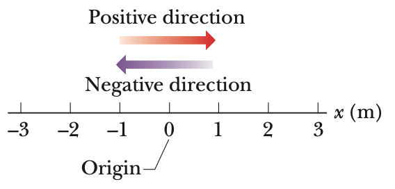

## Position, Displacement, And Average Velocity

### 개념 요약

- 이동 거리
    + 이동 거리란 물체가 이동한 경로의 길이로, 스칼라량(크기는 갖되, 방향성은 갖지 않는 양)이다.

- 변위
    + 처음 위치에서 나중 위치까지의 위치 변화량으로, 벡터량(크기와 방향성 둘 다 갖는 양)이다. 
    + $x_1$은 처음 위치, $x_2$는 나중 위치라고 할 때, 변위는

        $$\Delta x = x_2 - x_1$$

    이다.

- 평균 속력
    + 이동 거리를 걸린 시간으로 나눈 값으로, 스칼라량이다. 
    + $t_1$은 처음 시점, $t_2$는 나중 시점일 때, 평균 속력

        $$s_{\text{avg}} = \frac{\text{total distance}}{t_2 - t_1} = \frac{\text{total distance}}{\Delta t}$$

    이다.

- 평균 속도
    + 변위를 걸린 시간으로 나눈 값으로, 물체의 운동 방향을 방향으로 삼는 벡터량이다.
    + $x_1$은 처음 위치, $x_2$는 나중 위치, $t_1$은 처음 시점, $t_2$는 나중 시점일 때, 평균 속도는

        $$v_{\text{avg}} = \frac{\Delta x}{\Delta t} = \frac{x_2 - x_1}{t_2 - t_1}$$

    이다. 
    + 시간 $t$에 대한 위치 $x$의 그래프에서 평균 속도 $v_{\text{avg}}$는 $(t_1, x_1)$와 $(t_2, x_2)$를 잇는 직선의 기울기라고 할 수 있다.

### 예제

### 연습 문제

<!--

  우리가 살고 있는 세계에서는 물체들이 운동을 하는 모습을 자주 관찰할 수 있다. 이번 단원에서는 이러한 운동 중에서 다음 3가지 조건을 만족하는 운동(가장 설명하기 쉬운 운동)만 취급해보려 한다.
1. 물체의 운동 방향은 직선 방향이어야 한다.
2. 물체의 운동만 고려하자. 물체의 운동을 유발하는 '힘'에 대해서는 후에 언급하도록 하겠다.
3. 물체가 미끄러지는 운동만 고려한다. 회전하는 운동은 고려하지 않는다. 회전 운동 또한 후에 언급하도록 하겠다.

  물체의 움직임을 서술하기 위해서는 당연히 먼저 위치에 대해 서술해야 한다. 윗 문단에서 말했다시피 우리는 직선 방향의 운동만 고려할 것이기 때문에 지금은 직선으로 위치를 표시하는 것이 좋겠다. 우선 기준점인 원점(Origin)을 잡고, 그 오른쪽 부분을 양의 방향(Positive Direction), 그 왼쪽 부분을 음의 방향(Negative Direction)으로 하자. 이를 그림으로 표현하면 다음과 같다.

{:height="25%" width="25%"}

  위치를 잡았으니, 물체가 운동한 후 변화한 거리인 변위(Displacement)에 대해서도 논할 수 있다. 만약 처음 물체가 $x = -3 \text{ m}$에 있었는데, 운동을 한 후에 $x = 5 \text{ m}$로 이동했다고 하자. 그러면 변위는 $\Delta x = 5 \text{ m} - (-3 \text{ m}) = 8 \text{ m}$가 된다. 이를 일반화해보자. 처음 있었던 위치를 $x_1$, 운동 후 변화한 위치를 $x_2$라 하면, 변위 $\Delta x$는 다음과 같다.

$$\Delta x = x_2 - x_1$$

  우리가 흔히 생각하는 이동 거리는 방향과 관계 없이 항상 $0$ 이상의 실수로만 이야기한다. 서울에서 부산까지의 거리가 어느 방향에든 관계없이 $325 \text{ km}$인 것처럼 말이다. 그러나 변위는 그 기준점을 어디로 잡느냐에 따라 음수로 설정될 수도 있다. 서울에서 부산까지 가는 하행을 양의 방향으로 잡는다면, 부산에서 서울로 갈 때 이동한 변위는 $-325 \text{ km}$가 되는 것이다. 이렇게 크기뿐만 아니라 방향까지 고려해야하는 변위는 벡터량으로 정의된다. (벡터에 관해서는 후에 다루도록 하겠다. 일단 지금은 넘어가자.)

  이동 거리와 변위에 대해 한 가지 더 이야기해보자. 서울에서 부산까지 가는 데 직선거리가 $325 \text{ km}$라면, 서울에서 부산까지 갈 때 변위는 $325 \text{ km}$일 것이다. 그러나 만약 이동 거리라면 서울에서 부산까지 갈 때 이용한 도로의 길이의 합(최소한 $325 \text{ km}$보다는 긴 거리)이 이동 거리가 될 것이다. 요약하자면 변위는 도착 위치에서 처음 위치를 뺀 순수한 변화지만, 이동 거리는 처음 위치에서 도착 위치로 가는 경로의 길이 전체를 합한 것이라 할 수 있겠다.

-->