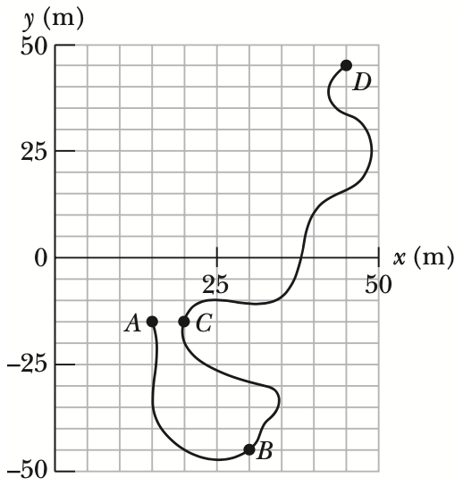
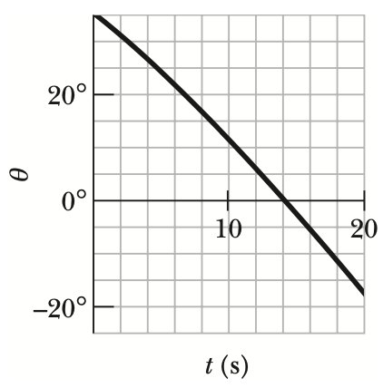

## Average Velocity and Instantaneous Velocity

### 개념 요약

- If a particle undergoes a displacement $\Delta \mathbf{r}$ in time interval $\Delta t$, its average velocity $\mathbf{v}_\text{avg}$ for that time interval is

$$\mathbf{v}_\text{avg} = \frac{\Delta \mathbf{r}}{\Delta t}$$

- As $\Delta t$ is shrunk to $0$, $\mathbf{v}_\text{avg}$ reaches a limit called either the velocity or the instantaneous velocity $\mathbf{v}$:

$$\mathbf{v} = \frac{d\mathbf{r}}{dt},$$

which can be rewritten in unit-vector notation as

$$\mathbf{v} = v_x\hat{i} + v_y\hat{j} + v_z\hat{k},$$

where $v_x = \frac{dx}{dt}$, $v_y = \frac{dy}{dt}$, and $v_z = \frac{dz}{dt}$.

- The instantaneous velocity $\mathbf{v}$ of a particle is always directed along the tangent to the particle’s path at the particle’s position.

### 예제

### 연습 문제

> #### 1. A train at a constant $60.0\text{ km}/\text{h}$ moves east for $40.0\text{ min}$, then in a direction $50.0^{\circ}$ east of due north for $20.0\text{ min}$, and then west for $50.0\text{ min}$. What are the (a) magnitude and (b) angle of its average velocity during this trip?
>
> (a) 40분간 동쪽으로, 50분간 서쪽으로 속도 변화 없이 이동했으므로 10분간 서쪽으로 이동한 것으로 간주해도 될 것이다. 따라서, 10분간 서쪽으로 이동한 후, 20분동안 $50.0^{\circ}$의 각도로 이동함으로 생각해보자. 그러면 동서방향으로 이동한 거리는 동쪽을 양의 방향으로 둘 때, $60.0\text{ km}/\text{h} \times \cos 50^{\circ} \times 20\text{ min} - 60.0\text{ km}/\text{h} \times 10\text{ min} = 12.9\text{ km} - 10.0\text{ km} = 2.9\text{ km}$이다. 그리고 북쪽으로는 $60.0\text{ km}/\text{h} \times \sin 50^{\circ} \times 20\text{ min} = 15.3\text{ km}$ 이동하였다. 따라서, 변위벡터를 $\mathrm{d}$라 하고, 그 크기를 $d$라 하면
>
> $$d = \sqrt{(2.9\text{ km})^2 + (15.3\text{ km})^2} = 15.6\text{ km}$$
>
> 이다.
>
> (b) 변위 벡터 $\mathbf{d}$를 좌표평면에 투사하면 $\tan \theta = \frac{d_y}{d_x}$이므로 각도를 구할 수 있다.
>
> $$\tan \theta = \frac{15.3\text{ km}}{2.9\text{ km}} = 5.3$$
>
> 이다. 그러므로 $\theta$는
>
> $$\arctan (\tan \theta) = \theta = 1.4\text{ (rad)}$$
>
> 이다.

> #### 2. An electron’s position is given by $\mathbf{r} = 3.00t \hat{i} − 4.00t^2 \hat{j} + 2.00 \hat{k}$, with $t$ in seconds and $\mathbf{r}$ in meters. (a) In unit-vector notation, what is the electron’s velocity $\mathbf{v}(t)$? At $t = 2.00\text{ s}$, what is $\mathbf{v}$ (b) in unit-vector notation and as (c) a magnitude and (d) an angle relative to the positive direction of the $x$ axis?
>
> (a) 위치 벡터를 미분하면 속도 벡터가 나온다.
>
> $$\mathbf{v}(t) = \mathbf{r}'(t) = (3.00 \hat{i} - 8.00t \hat{j})\text{ m}/\text{s}.$$
>
> (b) (a)에서 구한 속도 벡터에 $t = 2.00\text{ s}$을 대입하자.
>
> $$\mathbf{v}(2.00) = (3.00 \hat{i} - 2.00 \times 8.00 \hat{j})\text{ m}/\text{s} = (3.00 \hat{i} - 16.0 \hat{j})\text{ m}/\text{s}.$$
>
> (c) (b)에서 구한 벡터를 $$\mathbf{v}_1$$라 하고 그 크기를 $$v_1$$이라 하자. 그러면
>
> $$v_1 = \sqrt{(3.00\text{ m}/\text{s})^2 + (-16.0\text{ m}/\text{s})^2} = 16.3\text{ m}/\text{s}$$
>
> 이다.
>
> (d) $x$축과 $\mathbf{v}_1$ 사이의 끼인 각을 $\theta$라 하자. 그러면
>
> $$\tan \theta = \frac{-16.0\text{ m}/\text{s}}{3.00\text{ m}/\text{s}} = -5.33$$
>
> 이고
>
> $$\theta = \arctan (\tan \theta) = -1.39 \text{ (rad)}$$
>
> 이다.

> #### 3. An ion’s position vector is initially $\mathbf{r} = 5.0 \hat{i} − 6.0 \hat{j} + 2.0 \hat{k}$, and $10 \text{ s}$ later it is $\mathbf{r} = −2.0 \hat{i} + 8.0 \hat{j} − 2.0 \hat{k}$, all in meters. In unit-vector notation, what is its $\mathbf{v}_\text{avg}$ during the $10\text{ s}$?
>
> 평균 속도는 변위를 걸린 시간으로 나눈 것이므로 변위를 먼저 구하자. 변위 벡터를 $\mathbf{d}$라 하면
>
> $$\mathbf{d} = (-2.0\text{ m} - 5.0\text{ m}) \hat{i} + (8.0\text{ m} - (-6.0)\text{ m}) \hat{j} + (-2.0\text{ m} - 2.0\text{ m}) \hat{k} = (-7.0\text{ m}) \hat{i} + (14.0\text{ m}) \hat{j} - (4.0\text{ m}) \hat{k}$$
>
> 이므로
>
> $$\mathbf{v}_\text{avg} = \frac{\mathbf{d}}{10 \text{ s}} = (-0.7 \text{ m}/\text{s}) \hat{i} + (1.4 \text{ m}/\text{s}) \hat{j} - (0.4 \text{ m}/\text{s}) \hat{k}.$$

> #### 4. A plane flies $483 \text{ km}$ east from city A to city B in $45.0 \text{ min}$ and then $966 \text{ km}$ south from city B to city C in $1.50 \text{ h}$. For the total trip, what are the (a) magnitude and (b) direction of the plane’s displacement, the (c) magnitude and (d) direction of its average velocity, and (e) its average speed?
>
> (a) 변위 벡터를 $\mathbf{d}$라 하면
>
> $$\mathbf{d} = (483\text{ km}) \hat{i} - (966\text{ km}) \hat{j}$$
>
> 이다. 따라서 변위의 크기를 $d$라 하면
>
> $$d = \sqrt{(483\text{ km})^2 + (-966\text{ km})^2} = 1080\text{ km}$$
>
> 이다. 
>
> (b) 변위 벡터와 $x$ 축이 이루는 각을 $\theta$라 하자. 그러면
>
> $$\tan \theta = \frac{-966\text{ km}}{483\text{ km}} = -2.00$$
>
> 이므로
>
> $$\theta = \arctan (\tan \theta) = -1.11 \text{ (rad)}$$
>
> 이다.
>
> (c) 평균 속도 $\mathbf{v}_\text{avg}$는
>
> $$\mathbf{v}_\text{avg} = \frac{\mathbf{d}}{2.25\text{ h}} = (215\text{ km}/\text{h}) \hat{i} - (429\text{ km}/\text{h}) \hat{j}$$
>
> 이다. 그러므로 평균 속도의 크기를 $v_\text{avg}$라 할 때,
>
> $$v_\text{avg} = \sqrt{(215\text{ km}/\text{h})^2 + (-429\text{ km}/\text{h})^2} = 480\text{ km}/\text{h}$$
>
> 이다.
>
> (d) 평균 속도 벡터와 $x$ 축이 이루는 각을 $\theta$라 하자. 그러면
>
> $$\tan \theta = \frac{-429\text{ km}/\text{h}}{215\text{ km}/\text{h}} = -2.00$$
>
> 이므로
>
> $$\theta = \arctan (\tan \theta) = -1.11 \text{ (rad)}$$
>
> 이다.
>
> (사실 평균 속도 벡터는 변위 벡터에서 상수인 $2.25 \text{ h}$만큼 나눈 것이므로 그 각이 바뀌지 않는 것은 자명하다.)
>
> (e) 평균 속력은 이동한 거리를 걸린 시간으로 나눈 것이므로 변위를 사용하면 안 된다. 이동한 거리를 $d'$이라 하면
>
> $$d' = 483 \text{ km} + 966 \text{ km} = 1449 \text{ km}$$
>
> 이므로 평균 속력 $s_\text{avg}$는
>
> $$s_\text{avg} = \frac{1449 \text{ km}}{2.25 \text{ h}} = 644 \text{ km}/\text{h}$$
>
> 이다.

> #### 5. Given figure gives the path of a squirrel moving about on level ground, from point $A$ (at time $t = 0$), to points $B$ (at $t = 5.00 \text{ min}$), $C$ (at $t = 10.0 \text{ min}$), and finally $D$ (at $t = 15.0 \text{ min}$). Consider the average velocities of the squirrel from point $A$ to each of the other three points. Of them, what are the (a) magnitude and (b) angle of the one with the least magnitude and the (c) magnitude and (d) angle of the one with the greatest magnitude?
>
> {:height="25%" width="25%"}
> ##### 
figure

>
> (a) 변위가 가장 작은 경로는 $A$에서 $C$로 가는 경로이다.

> #### 6. The position vector $\mathbf{r} = 5.00t \hat{i} + (et + ft^2) \hat{j}$ locates a particle as a function of time $t$. Vector $\mathbf{r}$ is in meters, $t$ is in seconds, and factors $e$ and $f$ are constants. Given figure gives the angle $\theta$ of the particle’s direction of travel as a function of $t$ ($\theta$ is measured from the positive $x$ direction). What are (a) $e$ and (b) $f$, including units?
>
> {:height="25%" width="25%"}
> ##### 
figure
